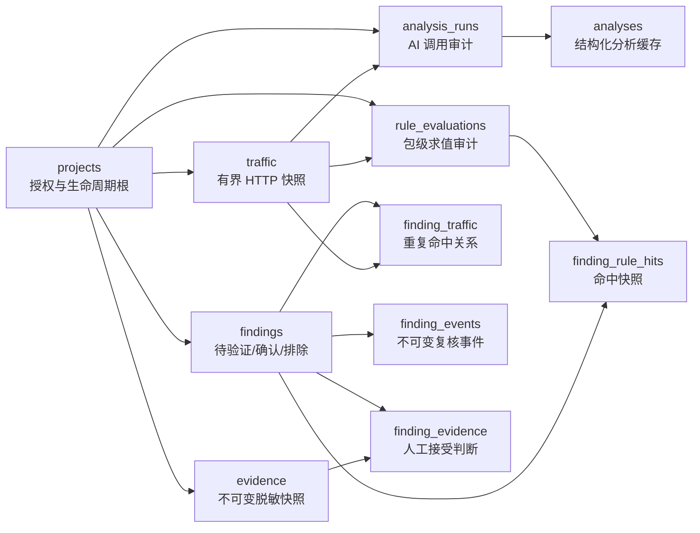
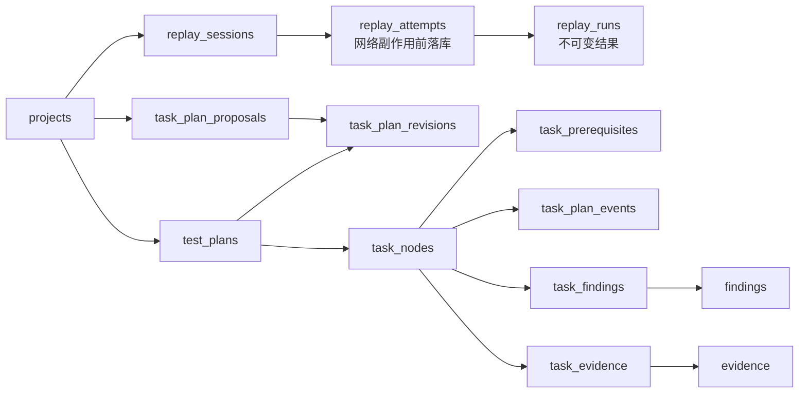

# RustForge 当前数据模型

> 基线：SQLite schema v1；实现核查日期：2026-07-29；源码真值：[`src-tauri/src/storage/migrations/v1.sql`](../../src-tauri/src/storage/migrations/v1.sql)、[`storage/models.rs`](../../src-tauri/src/storage/models.rs) 及各领域 service。

本文描述当前预发布数据模型及其数据库强制约束。它不是未来迁移承诺；字段和枚举若与本文冲突，以 v1 SQL、Rust 模型和测试为准。

## 版本与连接策略

- `LATEST_SCHEMA_VERSION = 1`，身份保存在 `PRAGMA user_version`。
- 空数据库直接创建当前 v1。无版本数据库只有在执行幂等 DDL 后完整符合当前结构、索引、外键和完整性检查时才标记为 v1。
- 版本高于应用、schema 畸形、外键损坏或完整性失败都会拒绝启动，不自动删除、降级或猜测修复。
- 应用先用独占连接完成 schema 检查，再创建最大 8 连接的 r2d2 pool。
- 每条连接启用 WAL、`foreign_keys = ON`、5 秒 `busy_timeout` 和 `synchronous = NORMAL`。
- 首次公开发布前不支持旧开发 schema 的兼容迁移、回填、legacy 列、双写或 dual-read；不一致的开发数据库应重建。发布后的迁移与备份必须另立计划。

## 领域关系总览

`evidence.source_type + source_id` 是有意设计的多态来源引用，不设置跨表外键；因此原 Traffic、AnalysisRun 或 ReplayRun 生命周期结束后，Evidence 的脱敏快照、来源身份与 hash 仍可保留。读取时再计算 `source_available`。

## 表目录

| 表 | 作用 | 关键约束 / 写入模型 |
|---|---|---|
| `settings` | 全局非敏感配置、当前项目和用量累计 | API Key 禁止写入；启动时扫描明文秘密 |
| `projects` | 一个授权目标/会话的生命周期根 | `scope` 为后端规范化 JSON 字符串数组 |
| `traffic` | MITM 请求/响应的有界快照 | 保存 wire/captured size、truncated、decode status；项目删除级联 |
| `replay_sessions` | Repeater 标签页/工作区 | 项目内只能有一个 selected；来源 Traffic 必须同项目 |
| `replay_attempts` | 网络副作用前的发送意图 | execution token 唯一；不可更新/单独删除 |
| `replay_runs` | 成功、拒绝、失败或中断的不可变结果 | outcome/Scope/status 组合有 CHECK；attempt 至多一个 run |
| `replay_run_delete_guards` | 允许父级生命周期级联的内部 guard | 无应用命令直接访问 |
| `prompt_versions` | 自定义分析提示词历史 | `(prompt_id, version)` 唯一；append-only |
| `analysis_runs` | 每次模型响应的审计 | valid/invalid 都保留；traffic 若存在必须同项目 |
| `analyses` | 通过校验的结构化流量分析缓存 | 每条记录唯一引用一个 AnalysisRun |
| `findings` | AI/规则产生的问题身份 | 新建必须 pending；状态/严重度/备注受事件约束 |
| `finding_events` | Finding 人工复核时间线 | append-only；rejected 原因必填 |
| `finding_traffic` | 同一 Finding 命中过的流量集合 | Finding 与 Traffic 必须同项目 |
| `evidence` | 来源独立的脱敏小快照 | 不可变；JSON ≤ 64 KiB；保存 SHA-256 和确认资格 |
| `finding_evidence` | Evidence 对某 Finding 的人工判断 | 初始 unaccepted；接受/撤销必须有匹配事件 |
| `rule_evaluations` | 单 traffic/包版本的求值审计 | `(traffic_id, pack_id, pack_version)` 唯一、可重试幂等 |
| `finding_rule_hits` | 升级为 Finding 的逐次命中快照 | 保存 pack/rule version、field、证据、置信度和 hit fingerprint |
| `task_plan_proposals` | 尚未直接执行的 AI 计划候选 | operation/status 白名单；绑定 base revision |
| `test_plans` | 项目当前计划头 | 每项目一行，保存 revision 和更新标记 |
| `task_plan_revisions` | 已提交计划版本 | `(project_id, revision)` 主键 |
| `task_nodes` | 当前与软归档计划节点 | stable key 项目内唯一；枚举、原因和归档时间有 CHECK |
| `task_prerequisites` | 与 parent 分离的执行依赖 | 同项目、活动节点、无自依赖、无环 |
| `task_findings` | 节点与 Finding | 同项目且 Finding 不能是 rejected |
| `task_evidence` | 节点与 Evidence | 同项目；只引用不可变快照 |
| `task_plan_events` | 计划变更审计 | append-only；项目/revision/node/proposal 上下文必须一致 |
| `task_plan_delete_guards` | 允许项目级联删除计划事件的内部 guard | 无应用命令直接访问 |

报告不持久化为业务表。`report.rs` 从上述当前状态与不可变审计构建 Evidence Report Schema v2，再同时渲染 Markdown 和 JSON。

## 核心不变量

### 项目隔离

- Traffic、AnalysisRun、Finding、Evidence、Replay 和测试计划实体均带 `project_id` 或可沿外键唯一归属项目。
- 数据库 trigger 拒绝跨项目的 replay source、Finding source、Finding-Traffic、Finding-Evidence、Task-Finding、Task-Evidence、parent 和 prerequisite。
- 应用层仍在服务入口检查项目；数据库约束作为绕过 service 时的 defense in depth。

### 有界 Traffic 不是完整报文声明

- `*_wire_size` 是流中实际观察的总字节数。
- `*_captured_size` 是最终入库的、可能解压后的有界表示大小。
- `*_truncated` 同时表达线缆上限、解压上限、错误或未完整结束。
- `*_decode_status` 决定正文能否作为文本、二进制或异常内容使用。下游 AI、规则、Evidence 和报告必须携带该状态，不能把前缀冒充完整正文。

### Repeater 副作用可审计

- Scope 拒绝发生在网络前，直接产生无 attempt 的 `scope_rejected` run。
- 通过 Scope 且准备好请求后，先提交 `replay_attempts`，再产生网络副作用。
- 正常完成或失败后追加对应 `replay_runs`；重启时无结果 attempt 转为 `APP_INTERRUPTED` run。
- attempt/run 不可变。只有会话或项目生命周期删除可以通过内部 guard 级联；存在 in-flight attempt 时父级删除被拒绝。

### Finding 是假设，Evidence 是观察

- `findings.source` 只有 `ai` 或 `rule`，新建状态必须是 `pending`。
- AI Finding 必须引用同项目且 `validation_status = valid` 的 AnalysisRun。
- 规则 Finding 使用全局唯一 SHA-256 fingerprint；fingerprint 已包含项目身份。
- `finding_events` 的最新匹配事件是修改 status/severity/notes 的先决条件。
- confirmed 需要至少一个 `finding_evidence.accepted = 1` 且对应 `evidence.qualifies_for_confirmation = 1` 的关系；最后一个合格接受项不能撤销。
- AnalysisRun Evidence 永不具备确认资格。Traffic 必须实际有响应；ReplayRun 必须有响应状态且 outcome 为 completed/response_incomplete。

### Evidence 保留来源事实，不保留无界原文

- 创建 Evidence 时立即生成脱敏、有界 JSON 和 `content_hash`，之后不可修改。
- `observation` 和 `created_by` 是创建时输入并一同冻结。
- 接受说明、actor 和时间属于 `finding_evidence` 关系，必须作为一次审计转换原子更新。
- 删除原始 Traffic 不会修改 Evidence；`source_available` 是读取期状态，不写回不可变行。

### 测试计划只通过 service 合并

- proposal 状态为 `pending / applied / rejected / superseded`；AI 输出不直接写 `task_nodes`。
- apply 时复核 project、base revision、Finding 状态和保护字段，在一个 immediate transaction 中写 revision、节点/关系、事件和 proposal 状态。
- stable key 用于跨 revision 对齐；人工节点、非 todo 进度、字段锁和 Evidence 关系受保护。
- status 变化必须有同项目、同节点、当前 revision 的最新 `status_changed` 事件。
- 节点删除在产品层是软归档；项目生命周期删除才真正级联。

## 稳定身份与 hash

| 身份 | 组成 | 用途 |
|---|---|---|
| 规则 hit fingerprint | `rule_id + method + normalized host + path without query + field_path` 的长度前缀 SHA-256 | 同一规则/端点/字段稳定命中；规则版本不参与 |
| Finding fingerprint | `project_id + hit fingerprint` 的长度前缀 SHA-256 | 项目内规则 Finding 去重 |
| Analysis input hash | system/user/retry、provider、model、prompt version、policy、Schema 等有序内容 | 预览与真正发送绑定 |
| Evidence content hash | 持久化脱敏 snapshot 字节 | 读取和报告时校验快照未漂移 |
| Replay request/response hash | 规范化请求与完整 wire 流（可得时） | 历史身份和 diff；截断时避免虚假相等 |
| 知识包 content hash | entries 的确定性 serde JSON | 启动时验证固定标准包内容 |

## 枚举摘要

| 对象 | 当前值 |
|---|---|
| Traffic decode status | `not_received / empty / identity_text / identity_binary / decoded_text / decoded_binary / decode_failed / unsupported_encoding / encoded_truncated / decode_truncated / stream_error / stream_incomplete` |
| Replay TLS | `strict / ignore_invalid` |
| Replay outcome | `completed / scope_rejected / request_failed / response_incomplete` |
| Finding status | `pending / confirmed / rejected` |
| Finding source | `ai / rule` |
| Evidence source | `traffic / analysis_run / replay_run` |
| Proposal operation | `generate / expand / alternative` |
| Proposal status | `pending / applied / rejected / superseded` |
| Task node type | `hypothesis / test / decision / manual_note` |
| Task source | `ai / rule / manual` |
| Task status | `todo / in_progress / done / blocked / skipped / not_applicable` |

## 删除语义

- 删除项目是明确的生命周期操作，会级联项目内流量、Finding、Evidence、Replay 和测试计划；in-flight replay 会阻止删除。
- 删除 Traffic 会清除依赖它的 analysis cache、rule evaluation 和关系行，并把 session/Finding/AnalysisRun 的可空主引用设为 NULL；独立 Evidence 快照保留到项目删除。
- Finding 删除会级联事件、Evidence 关系、规则命中和任务关系；Evidence 实体仍可被其它关系引用。
- 产品不暴露单独更新/删除 Evidence、Replay run、Finding event 或 TaskPlan event 的命令。

## 修改模型时的同步清单

任何字段或关系变更必须在一个任务中同步：

1. `v1.sql` DDL、CHECK、index、trigger 与结构验证。
2. Rust row mapping、领域模型和 service 事务。
3. Tauri command 与 `src/api/tauri.ts` 类型。
4. Vue store/view 的所有调用方。
5. 空库、重复打开、完整性、跨项目、级联和失败回滚测试。
6. 本文、[security-boundaries.md](security-boundaries.md) 及受影响 Phase 说明。

预发布期间不要为旧开发库增加临时兼容字段；首次公开发布后则不能继续沿用“重建即可”的策略，必须另行设计真实迁移与备份。
