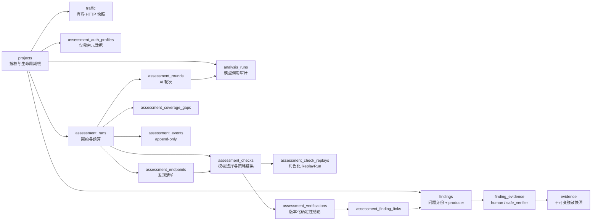

# RustForge 当前数据模型

> 基线：SQLite schema v3；实现核查日期：2026-08-01；源码真值：[`src-tauri/src/storage/migrations/`](../../src-tauri/src/storage/migrations/)、[`storage/models.rs`](../../src-tauri/src/storage/models.rs) 与各领域 service。

本文描述当前预发布数据模型及数据库强制约束。字段或枚举若与本文冲突，以迁移 SQL、Rust 模型和自动测试为准。

## 版本与迁移策略

- `LATEST_SCHEMA_VERSION = 3`，版本保存在 `PRAGMA user_version`。
- 空库依次执行 v1、v2、v3；既有 v2 数据库通过真实 v3 migration 增量升级，不重建核心表，不删除旧 task tree。
- v3 为 Assessment 新建领域表，并通过 `ALTER TABLE` 扩展 `replay_sessions`、`findings` 与 `finding_evidence`。旧 replay session 回填为 `manual`，旧 Evidence 接受来源回填为 `human`。
- 每一步迁移在事务中执行；失败回滚且不提高 `user_version`。重复打开已升级数据库不重复写入。
- 启动验证列、表、索引、触发器、外键目标与 `ON DELETE` action；版本过高、schema 畸形、foreign key/integrity 检查失败均拒绝启动。
- 应用先用独占连接完成迁移/验证，再创建最大 8 连接的 r2d2 pool；连接启用 WAL、`foreign_keys = ON`、5 秒 `busy_timeout` 和 `synchronous = NORMAL`。

## 领域关系总览

Assessment 的内部 replay 仍使用既有 `replay_sessions → replay_attempts → replay_runs` 传输与不可变审计，但 session 标记为 `owner_kind = assessment` 并绑定 run；手动 Repeater API 只读取 `owner_kind = manual`。

旧 `task_plan_proposals / test_plans / task_plan_revisions / task_nodes / task_*` 关系完整保留，继续支持历史 API，但与 Assessment 没有外键或双写。`/tasks` 主导航不再加载旧树。

`evidence.source_type + source_id` 是有意的多态来源引用，不设置跨表外键；原 Traffic、AnalysisRun 或 ReplayRun 生命周期结束后，Evidence 的脱敏快照、来源身份与 hash 仍可保留，读取时计算 `source_available`。

## Assessment 表目录

| 表 | 作用 | 关键约束 / 写入模型 |
|---|---|---|
| `assessment_auth_profiles` | 身份标签、允许的 Header、来源 Traffic、秘密修订 | 不保存秘密值；项目内 label 唯一；来源 Traffic 必须同项目 |
| `assessment_runs` | 状态、URL/origin、契约及 hash、registry hash、身份、AI、TLS、预算、停止原因 | 全局唯一活动 run；最多三轮、300 请求、2 RPS、20 MiB；状态更新前必须已有事件 |
| `assessment_rounds` | 每轮 planning 状态、AnalysisRun、输入/输出 hash、选择/拒绝数量 | `(run_id, round_number)` 唯一；轮次 1..3、check ≤ 12 |
| `assessment_endpoints` | start/crawl/redirect/traffic 端点、参数名、响应元数据、资源归属 | `(run_id, endpoint_key)` 唯一；只允许 GET/HEAD 清单；身份与 Traffic 必须同项目 |
| `assessment_checks` | AI 请求的 endpoint/template/parameter/identity 与后端策略/执行状态 | 保存被拒绝的伪造选择；端点/轮次必须属于同 run；单选择组合唯一 |
| `assessment_check_replays` | check 与 baseline/probe/A/B 等角色 ReplayRun 的关系 | ReplayRun 必须来自同 run 的 assessment session；不可跨项目借证据 |
| `assessment_verifications` | verifier ID/version、verdict、结构化观察与 content hash | 每 check 最多一个；不可更新或单独删除 |
| `assessment_finding_links` | verification 与 Finding 的 supports/human_conflict 关系 | 必须同项目；运行存在期间关系不可修改/删除 |
| `assessment_coverage_gaps` | 策略跳过、身份不足、预算/响应限制和主动不覆盖 | 可选关联同 run check；结构化 category/reason code |
| `assessment_events` | run/check 的状态与审计时间线 | append-only；run/check 必须一致；run 状态变化要求先写事件 |

## 既有表的 v3 扩展

| 表 | 新字段 | 语义 |
|---|---|---|
| `replay_sessions` | `owner_kind`, `assessment_run_id` | `manual` 不得绑定 run；`assessment` 必须绑定同项目 run，且 owner/run 不能事后改写 |
| `findings` | `producer` | `ai / passive_rule / safe_verifier`；保留 `source = ai / rule` 兼容核心 Finding 逻辑 |
| `finding_evidence` | `acceptance_kind`, `verification_id` | `human` 不绑定 verification；`safe_verifier` 必须绑定同 Finding、同 check 的合格 confirmed verification/Replay Evidence |

## 其它核心表

| 领域 | 主要表 | 关键语义 |
|---|---|---|
| 项目/设置 | `projects`, `settings` | 项目是隔离和级联根；settings 禁止秘密 |
| Traffic | `traffic` | 保存 wire/captured size、truncated、decode status；正文有界 |
| AI | `prompt_versions`, `analysis_runs`, `analyses` | 每次 valid/invalid 调用可审计；缓存只引用 valid run |
| 规则 | `rule_evaluations`, `finding_rule_hits`, `finding_traffic` | 包/规则版本固定，稳定 fingerprint 去重 |
| Finding | `findings`, `finding_events` | 新建 pending；状态、严重度、备注必须有先行 append-only event |
| Evidence | `evidence`, `finding_evidence` | 脱敏 snapshot 与 content hash 不可变；接受判断在关系表 |
| Replay | `replay_sessions`, `replay_attempts`, `replay_runs` | 网络前 attempt，结果 run 不可变；启动恢复孤立 attempt |
| 旧计划 | `task_plan_*`, `test_plans`, `task_nodes`, `task_*` | proposal/revision/事件与软归档仍保留，只作隐藏兼容 |

报告不作为业务表持久化。`report.rs` 从当前 Finding/Evidence 与可选 Assessment run 构建 Evidence Report Schema v3，再从同一个 document 渲染 Markdown 和 JSON。

## 核心不变量

### 项目隔离与生命周期

- Traffic、AnalysisRun、Finding、Evidence、Replay、Assessment 与旧 task entities 均带 `project_id` 或沿外键唯一归属项目。
- trigger 拒绝跨项目的 profile source、run identities、round、endpoint、check、assessment replay、verification link、gap/event 以及既有 Finding/Evidence/Replay/task 关系。
- 项目删除会级联项目内业务数据；存在活动 Assessment 时 service 在删除前拒绝。用户必须先取消并等待终态。
- profile 删除先清系统凭据再删 metadata；项目删除收集所有 credential ID 并执行补偿清理，避免明文或孤儿凭据。

### 运行契约与状态审计

- contract hash 固定 Scope、精确 origin、排除路径、TLS、预算、身份 ID/revision、归属声明、AI provider/model、脱敏策略和模板 registry。
- `assessment_runs_one_active` 在数据库层保证全局最多一个 queued/discovering/planning/executing/verifying run。
- run 状态不能在缺少先行 `assessment_events` 的情况下直接更新；event 和 verification 都不可变。
- 启动时遗留活动 run 变为 `interrupted`，开放 check 终结；不会自动恢复网络动作。

### 秘密不进入 SQLite 与审计

- `assessment_auth_profiles` 只有 Header 名、label、来源和 `secret_revision`。系统凭据库 key 由 project/profile 身份派生。
- Assessment live Header 与 audit Header 在内存结构中分离；持久化请求使用 `[AUTH_PROFILE:<id>]`。
- Assessment request hash 基于脱敏 Header、profile ID 与 revision，不包含值；响应 snapshot 会再次遮盖已知秘密及其常见编码。

### Replay 副作用可审计

- Scope/AssessmentPolicy 拒绝发生在 socket 前；被允许的请求先写 `replay_attempts`，再执行网络动作。
- 正常、失败、不完整或取消结果追加为不可变 `replay_runs`；崩溃留下的 attempt 由启动恢复逻辑终结。
- 手动 API 无法枚举、读取或发送 Assessment session。`assessment_check_replays` 只接受同 run session 的 ReplayRun。

### Finding、Verification 与 Evidence

- AI 与被动规则只创建 pending Finding；安全验证器使用既有规则 fingerprint 创建/复用 `source = rule, producer = safe_verifier` Finding。
- `commit_verification_outcome` 在一个事务中写 verification、Finding/link、Replay Evidence、Evidence 接受、Finding events 与状态。
- `confirmed` verification 才能产生 `acceptance_kind = safe_verifier, accepted = 1`；suspected/inconclusive Evidence 保持未接受。
- 数据库验证 safe-verifier Evidence 的 verification verdict、Finding link、check 与 ReplayRun 关系。人工 rejected 只建立 `human_conflict`，不改变状态。
- AnalysisRun Evidence 永远不具备确认资格；截断/不完整 Assessment 响应不能支撑自动确认。

### 旧测试计划隔离

- proposal 仍只能由旧 tree service 合并，保留 revision、人工锁、状态事件与软归档约束。
- Assessment 不创建/更新 task node；报告只能把旧计划作为 `legacy_plan_summary` 附录，不能当作执行结果。

## 稳定身份与 hash

| 身份 | 组成 | 用途 |
|---|---|---|
| Assessment contract hash | 规范化契约 + identity revision + registry version/hash | 预览与启动/执行时数据绑定 |
| Endpoint key/opaque ID | run 内规范化 method/origin/path/query 参数身份的 SHA-256 派生 | 模型引用端点，不暴露可编辑 URL |
| Verification content hash | verifier/version/verdict/结构化观察的确定性 JSON | 阻止事实结论漂移 |
| Finding fingerprint | 项目 + 规则/安全验证器稳定身份 | 项目内去重，保留人工状态 |
| Evidence content hash | 持久化脱敏 snapshot 字节 | 读取与报告时校验 |
| Replay request hash | 脱敏请求 + profile ID/revision | 比较请求且不混入 secret value |
| Replay response hash | 完整原始响应（可得时）的 hash | A/B 等价判断；snapshot 仍脱敏 |

## 枚举摘要

| 对象 | 当前值 |
|---|---|
| Assessment status | `queued / discovering / planning / executing / verifying / completed / stopped / cancelled / failed / interrupted` |
| Assessment verdict | `confirmed / suspected / not_observed / inconclusive / skipped` |
| Identity mode | `anonymous / a / b / a_vs_b` |
| Replay owner | `manual / assessment` |
| Finding status | `pending / confirmed / rejected` |
| Finding source | `ai / rule` |
| Finding producer | `ai / passive_rule / safe_verifier` |
| Evidence acceptance | `human / safe_verifier` |
| Replay outcome | `completed / scope_rejected / request_failed / response_incomplete` |

## 修改模型时的同步清单

任何字段或关系变更必须在一个任务中同步：

1. 新迁移 SQL、`LATEST_SCHEMA_VERSION` 与完整结构/FK/trigger validation。
2. Rust row mapping、领域模型、service 事务与启动恢复。
3. Tauri commands、事件与 `src/api/tauri.ts` 类型。
4. Vue store/view 的项目与 run ownership。
5. 空库、逐版本升级、重复打开、失败回滚、跨项目、不可变、级联和秘密泄漏测试。
6. 本文、[security-boundaries.md](security-boundaries.md)、[AUTHORIZATION.md](../AUTHORIZATION.md) 与受影响 Phase 说明。
