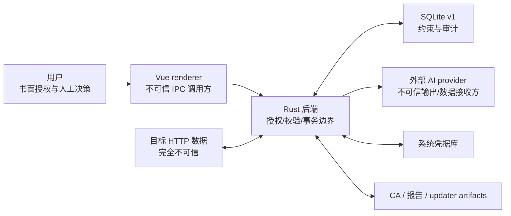

# RustForge 安全边界与失败策略

> 实现核查日期：2026-07-29；适用范围：当前 Tauri/Vue 桌面应用与 SQLite v1 基线。

RustForge 的核心边界不是“模型足够谨慎”，而是后端授权、大小上限、结构校验、事务约束和人工确认共同形成的可测试系统。本文记录当前代码强制的边界、跨边界数据和失败方式。

## 信任分区

信任假设：

- 用户负责合法授权、测试时间窗和每次主动操作的意图。
- renderer 可被错误状态、延迟 Promise 或恶意 HTTP/Markdown 内容影响，因此不能持有最终授权权力或秘密。
- 目标的 URL、Header、正文、证书和响应都不可信。
- 模型输入中的 HTTP 内容可能包含提示注入；模型输出可能格式错误、伪造引用或声称执行了动作。
- 即使未来允许导入规则包，也必须把包当作不可信数据；当前内置包同样经过启动校验。
- SQLite 不是秘密存储，但 trigger/foreign key 是防止未来调用方绕过 service 的第二道约束。

## 边界一：目标授权

### 强制点

- `authorization::ScopePolicy` 是代理和 Repeater 共用的 host 规范化/匹配实现。
- 代理从 `current_project_id` 加载项目；Repeater 必须携带显式项目和项目内 session。
- 无项目、空/坏 Scope 或未命中时 fail closed。私网、loopback、link-local 没有隐式豁免。
- 完整 URL 主动请求只接受 HTTP(S)，拒绝 userinfo、缺失 authority/host、反斜杠歧义、控制字符和非法端口。

### 代理与 Repeater 的不同语义

| 路径 | Scope 外行为 | 是否可能向目标发送 |
|---|---|---|
| 浏览器经代理 | HTTPS 盲隧道、HTTP 透传；不解密、不记录、不跑规则 | 可能，由浏览器原始请求决定；Scope 不是防火墙 |
| Repeater | 保存 `scope_rejected` run 后返回 | 不会；校验发生在客户端/socket 创建前 |

Repeater 不跟随重定向，避免一次授权后跳到另一个 host。未来若支持重定向，每一跳都必须重新过 Scope。

### 当前表达能力限制

Scope 只表达 host。端口、路径、账号、动作类型、请求频率和时间窗不进入策略；更窄的书面授权必须依赖额外网络/流程控制。详细用户责任见 [../AUTHORIZATION.md](../AUTHORIZATION.md)。

## 边界二：网络副作用

当前出站路径：

| 路径 | 触发方式 | 保护 |
|---|---|---|
| 代理转发 | 用户在外部浏览器发起 | Scope 只控制 MITM/记录；正文流式转发 |
| Repeater | 用户每次明确点击发送 | 后端 Scope、持久化 attempt、30 秒超时、无自动重定向 |
| AI `/models` | 用户在 provider 设置中测试/刷新 | Key 后端读取，Base URL 必须是无 userinfo/query/fragment 的 HTTP(S) URL |
| AI chat | 用户确认最终上下文后触发分析/计划 | preview hash 重建比对、脱敏、硬上限、输出校验 |
| updater check | 应用一次静默检查或用户手动检查 | 固定 HTTPS endpoint、签名验证；它不是目标测试请求 |
| 外部链接 | 用户点击 | 只允许 HTTP(S)，拒绝空白/控制字符/引号，直接调用系统 opener 而不经过 shell |

规则、Finding、Evidence 到达和测试计划状态变化都不能触发目标网络请求。AI planner 只生成 proposal；只有用户进入 Repeater 并发送才产生验证请求。

## 边界三：HTTP 内存与证据完整性

- 代理/Repeater 每个方向最多保留 1 MiB wire bytes；完整 body 仍继续转发/读取。
- gzip/deflate/br 的每层解码最多输出 1 MiB；压缩前后均受限。
- `wire_size` 来自实际 frame/chunk，不能用 `Content-Length` 冒充。
- stream error、下游取消、线缆/解压上限、未知编码和二进制均有稳定状态。
- 下游必须同时读取 `captured_size + truncated + decode_status`；只读 body 字节会误把前缀当完整证据。
- 重复 Header 有序保存；`Set-Cookie` 不折叠，避免字段边界被破坏。

失败策略：保住转发与可见诊断，保存有界前缀并标记不完整；不把异常状态静默改为正常文本。

## 边界四：秘密与本地密钥

### Provider API Key

- `SecretStore` 使用 OS credential backend；SQLite/普通设置只存 metadata。
- renderer 只能看到 `has_api_key`，不能读取 Key。
- 通用 settings 读写拒绝敏感 key、嵌套 secret、bearer/JWT/私钥形态。
- 应用启动检测明文秘密，发现后停止，而不是兼容旧明文格式。
- 日志和错误通过 `redact_sensitive` 过滤；已知秘密也作为额外匹配值遮盖。

### MITM CA

- CA 私钥与证书必须成对存在；半套材料会停止代理。
- 目录/私钥文件禁止符号链接并收紧到当前用户；无法验证权限时不继续。
- 私钥先写安全临时文件、同步、原子 rename；内存 PEM 使用 zeroize。
- 导出函数只能访问公钥证书路径。UI/日志不返回私钥路径或内容。

失败策略：凭据库或私钥权限失败时关闭相应能力，不回退为明文或宽松权限。

## 边界五：AI 数据披露与提示注入

### 默认披露策略

| 数据 | 默认 | 后端硬上限 |
|---|---:|---:|
| 请求正文 | 8 KiB | 24 KiB |
| 响应正文 | 12 KiB | 24 KiB |
| 单次总上下文 | 32 KiB | 64 KiB |

- 查询值、凭据 Header、JSON/form/multipart 秘密字段、常见 token 和高熵值默认遮盖。
- 截断、二进制和解码异常正文默认不发送。
- 放宽任一遮盖/正文状态或超过安全默认值都产生 `is_relaxed`，要求额外确认。

### 预览与发送绑定

- 预览包含最终 system/user/retry 内容、provider、model、prompt ID/version、policy、manifest、Schema 和 evidence refs。
- 长度前缀 SHA-256 绑定这些有序字段；执行时从数据库重建并比对，旧预览不能授权新数据。
- 原始 HTTP 值只出现在 `UNTRUSTED_HTTP_DATA` 区；闭合标记转义，模板值不会被二次解释为占位符。
- 固定 system prompt 禁止把 HTTP 指令当系统指令、禁止伪造观察、禁止执行攻击或声明 confirmed。

### 输出验证

- serde 结构拒绝未知字段；长度、枚举、假设数和 standard reference 再做本地校验。
- evidence refs 必须来自本次实际上下文；grounding 不足会降级，而不是伪造证据。
- 首次失败只用固定 retry suffix 重试一次。invalid AnalysisRun 仍留审计，但不能创建 Finding。

失败策略：上下文 hash 漂移、Schema/引用无效或校验失败时停止建 Finding，不降低脱敏或伪装为成功。

## 边界六：声明式规则

- schema 没有 action/script/file/process/network 原语；求值只读已捕获 Traffic。
- 包加载期限制规则数、条件深度、正则源码/程序/DFA/nesting、JSONPath 子集和 selector/extractor 兼容性。
- 求值期限制候选数、证据片段和单包 wall-clock；正文/headers/cookies 每包只解析一次并复用。
- worker 队列容量 256，`try_send` 不阻塞代理；满队列丢弃规则任务并递增诊断计数。
- 坏包变为 disabled，返回零命中并暴露脱敏原因；不 panic、不影响代理转发。
- 命中片段再次脱敏；截断正文命中标为 incomplete，置信度上限 40。
- medium 以上只创建 pending Finding，稳定指纹去重，不覆盖人工状态。

详细格式见 [rule-pack-v1.md](rule-pack-v1.md)。

## 边界七：Finding、Evidence 与人工确认

- AI/规则结果是 Finding 假设；Evidence 是来源独立的不可变脱敏观察。
- AnalysisRun 永远不具备 confirmation 资格；没有真实响应的 Traffic、没有响应 status 的 ReplayRun 也不具备资格。
- Evidence 初始关联为 unaccepted。接受/撤销必须由用户提供 actor/说明并写入 Finding append-only 事件。
- confirmed 状态需要至少一条人工接受的合格 Evidence；数据库 trigger 阻止绕过 service，也阻止撤销最后一条合格证据。
- rejected 需要原因。status、severity 和 analyst notes 的每次变化都有不可变事件。

失败策略：跨项目关系、来源不存在、hash 损坏、资格不足或事件不匹配时事务整体回滚。

## 边界八：测试计划

- 模型只输出 `PlannedTree` 允许字段，不能设置 status、actual observation、Evidence 或数据库 ID。
- 生成/展开/换思路统一创建持久化 proposal 和四类 diff，不直接写当前节点。
- apply 在 immediate transaction 中复核 base revision、项目、Finding 状态、字段锁、人工进度、Evidence 和 prerequisite。
- Evidence 到达只设置 `needs_update` 并 supersede 旧 proposal，不调用 AI、不推进节点。
- 状态变化要求匹配 append-only 事件；归档保留历史。

失败策略：任何并发变化或保护边界冲突都会拒绝/失效 proposal，不做部分合并。

## 边界九：报告与文件输出

- 默认报告只读取不可变脱敏 Evidence 并重算 hash；confirmed 缺少合格 Evidence 时拒绝整份报告。
- pending 只进附录、rejected 默认省略；建议步骤和实际观察分栏。
- 同一结构化 document 生成 Markdown 与 JSON，避免两个格式语义漂移。
- 用户文本、行首 Markdown、动态代码围栏、URL 和文件组件均转义/规范化。
- 使用 `create_new` 和冲突后缀，不覆盖旧文件；任一写入失败会清理本次文件对。
- 原始敏感来源只能通过该次后端原生模态确认附加；renderer 不能生成确认 token，选择不持久化。

失败策略：hash、关系、文件名或双文件写入任一失败都明确返回错误，不留下看似完整的半报告。

## 边界十：renderer 与桌面运行时

- 生产 CSP 的 `connect-src` 只允许 Tauri IPC；开发模式只额外允许本机 Vite/HMR。
- 项目切换使旧 Promise/代际 ownership 失效；Findings、计划、报告、规则诊断和 Repeater 不接纳旧项目延迟结果。
- Repeater 在第一次 `await` 前同步取得唯一发送令牌，快速双击/Enter 不产生两个网络副作用。
- 前端所有确认仅是交互层；后端仍执行 Scope、项目、hash、关系和状态检查。

## 不变量对应的主要测试

| 边界 | 测试重点 |
|---|---|
| Scope | IDN/IP/通配/userinfo/歧义 URL、代理/Repeater 一致、越界无 socket |
| Capture | chunked、错误长度、压缩炸弹、流取消、重复 Header、峰值内存 |
| Secrets/CA | 凭据不回前端、日志过滤、ACL/权限、原子写、只导出证书 |
| AI | 结构化脱敏、提示注入语料、preview hash TOCTOU、invalid run 不建 Finding |
| Rules | 恶意 regex/深度/候选、超时、队列满、截断置信度、shadow 评测 |
| Evidence | 跨项目、来源资格、事件、最后合格证据、不可变 snapshot/hash |
| Plan | proposal 幂等、人工锁、并发 revision、依赖环、阻塞祖先 |
| Report | confirmed 资格、秘密泄漏、Markdown 注入、双文件、确定性快照 |

## 当前明确不覆盖

- 无人值守扫描、自动利用、自动 PoC、自动修复或模型驱动 shell。
- WebSocket 消息历史、SSE、gRPC、GraphQL 和完整 HTTP/2 语义。
- 第三方规则/插件市场、任意脚本和在线自动更新规则。
- 源码调用链分析；Vulnhuntr 类思路只属于未来独立源码辅助模式。
- 首次公开发布后的数据库升级/备份策略。

新增任何网络、文件、进程或插件能力前，必须先在本文登记信任区、授权点、审计实体、预算、失败策略和测试，再进入实现。
