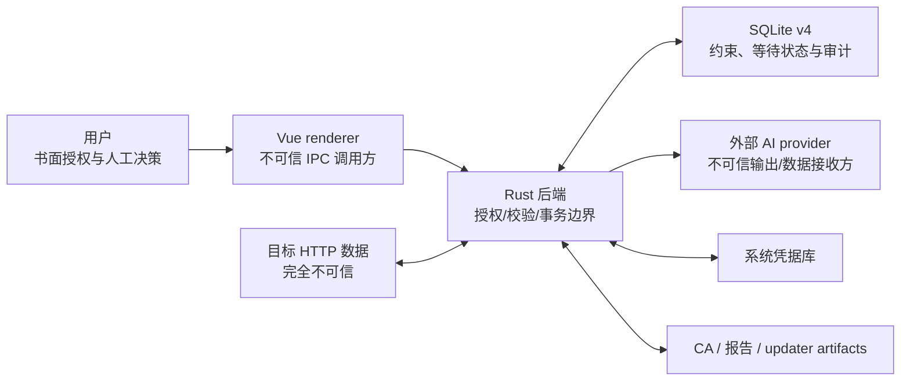

# RustForge 安全边界与失败策略

> 实现核查日期：2026-08-03；适用范围：当前 Tauri/Vue 桌面应用与 SQLite v4 / Assessment Mission v2 基线。

RustForge 的核心边界不是“模型足够谨慎”，而是后端 mission 契约、ToolSpec registry、权限/审批状态机、`AssessmentPolicy + ScopePolicy`、大小/速率预算、结构校验、确定性验证器和事务约束共同形成的可测试系统。本文记录当前代码强制的边界、跨边界数据和失败方式。

## 信任分区

信任假设：

- 用户负责合法授权、测试时间窗、运行契约和资源归属声明的真实性。
- renderer 可被错误状态、延迟 Promise 或恶意 HTTP/Markdown 内容影响，因此不能持有最终授权权力或秘密。
- 目标的 URL、Header、正文、证书和响应都不可信。
- 模型输入中的 HTTP 内容可能包含提示注入；模型输出可能格式错误、伪造引用或声称执行了动作。
- 即使未来允许导入规则包，也必须把包当作不可信数据；当前内置包同样经过启动校验。
- SQLite 不是秘密存储，但 trigger/foreign key 是防止未来调用方绕过 service 的第二道约束。

## 边界一：目标授权

### 强制点

- `authorization::ScopePolicy` 是代理、Repeater 和 Assessment 共用的 host 规范化/匹配实现；Assessment 还叠加更严格的 `AssessmentPolicy`。
- 代理从 `current_project_id` 加载项目；Repeater 必须携带显式项目和项目内 session。
- 无项目、空/坏 Scope 或未命中时 fail closed。私网、loopback、link-local 没有隐式豁免。
- 完整 URL 主动请求只接受 HTTP(S)，拒绝 userinfo、缺失 authority/host、反斜杠歧义、控制字符和非法端口。

### 三类目标路径的不同语义

| 路径 | Scope 外行为 | 是否可能向目标发送 |
|---|---|---|
| 浏览器经代理 | HTTPS 盲隧道、HTTP 透传；不解密、不记录、不跑规则 | 可能，由浏览器原始请求决定；Scope 不是防火墙 |
| Repeater | 保存 `scope_rejected` run 后返回 | 不会；校验发生在客户端/socket 创建前 |
| Assessment | check 记为 policy rejected 并形成 coverage gap | 不会；契约、精确 origin、方法、路径、Header、正文与预算均在 socket 前复核 |

Repeater 不跟随重定向，避免一次授权后跳到另一个 host。未来若支持重定向，每一跳都必须重新过 Scope。

### 当前表达能力限制

Scope 只表达 host。Assessment 的单次契约额外固定端口/origin、路径排除、账号 profile、动作类型、请求频率和预算；授权时间窗仍需额外网络/流程控制。详细用户责任见 [../AUTHORIZATION.md](../AUTHORIZATION.md)。

## 边界二：网络副作用

当前出站路径：

| 路径 | 触发方式 | 保护 |
|---|---|---|
| 代理转发 | 用户在外部浏览器发起 | Scope 只控制 MITM/记录；正文流式转发 |
| Repeater | 用户每次明确点击发送 | 后端 Scope、持久化 attempt、30 秒超时、无自动重定向 |
| Assessment Mission | 用户确认上下文；action 按后端权限自动或逐项获批 | ToolSpec/权限 hash、`AssessmentPolicy + ScopePolicy`、单并发、attempt 先落库、预算/速率/取消、无自动重定向 |
| 人工 handoff | 后端只生成 Repeater 草稿；用户在 Repeater 点击发送 | `manual` session、同项目 handoff、普通 Repeater Scope 复核；创建/打开/回传 API 均不发送 |
| AI `/models` | 用户在 provider 设置中测试/刷新 | 已保存 Key 由后端从凭据库读取；未保存 Key 只经专用 IPC 用于当次请求且不落库；Base URL 必须是无 userinfo/query/fragment 的 HTTP(S) URL |
| AI chat | 用户确认最终上下文后触发分析/计划 | preview hash 重建比对、脱敏、硬上限、输出校验 |
| updater check | 应用一次静默检查或用户手动检查 | 固定 HTTPS endpoint、签名验证；它不是目标测试请求 |
| 外部链接 | 用户点击 | 只允许 HTTP(S)，拒绝空白/控制字符/引号，直接调用系统 opener 而不经过 shell |

规则、Finding、Evidence 到达、附件导入、消息、等待态恢复和旧测试计划状态变化都不能触发目标网络请求。Mission 只有在 context hash 被确认、动作权限满足并调用开始/恢复后，才可进入串行 runner；AI 选择工具不能绕过后端策略，也不能调用 Repeater 发送 API。

### Assessment 请求安全不变量

- contract/context hash 绑定项目与规范化 Scope、起始 URL 和精确 origin、TLS、预算档位/速率、身份 profile 与秘密修订、项目资源摘要、AI provider/model、脱敏披露、ToolSpec registry 和工具权限快照；确认、启动、审批和执行时重建关键漂移项。
- 全局最多一个网络活动 mission，请求并发固定为 1。快速/标准/深入分别是 40/120/300 请求与 2/4/6 次规划；硬上限 2 RPS、300 请求。
- 只允许无正文的 `GET / HEAD / OPTIONS`，禁止 Host/长度/连接/升级/代理鉴权/方法覆盖 Header；危险路径段和 `_method`、破坏性 `action/do` 参数会重复 URL 解码后检查。
- 只访问精确 origin。3xx 不跟随；同源 Location 作为新候选重新校验，跨源只形成 coverage gap。
- 429 立即停止；连续三个 5xx/超时停止；Scope、身份、AI 或 registry 漂移以及用户取消都会停止，目标请求不自动重试。
- 每响应最多读取 1 MiB、每轮最多 20 MiB；超限停止读取并标记不完整，不完整响应没有自动确认资格。
- `disabled`、拒绝、待审批、过期 revision、伪造 tool/resource/surface/参数和 manual recipe 都在 socket 创建前返回或持久等待。
- 启动时只有 `discovering/planning/executing/verifying` mission/run 转为 `interrupted`；上下文、动作、人工 handoff 等等待态原样恢复并释放执行器。

“非破坏”描述的是客户端不提供状态变更方法、正文、攻击脚本、任意 payload、浏览器执行或暴力能力；目标若错误地让 GET 改变状态仍是残余风险，不能由客户端证明为零。

## 边界三：HTTP 内存与证据完整性

- 代理/Repeater 每个方向最多保留 1 MiB wire bytes；Assessment 在 1 MiB 时主动停止读取并把响应标为不完整。
- gzip/deflate/br 的每层解码最多输出 1 MiB；压缩前后均受限。
- `wire_size` 来自实际 frame/chunk，不能用 `Content-Length` 冒充。
- stream error、下游取消、线缆/解压上限、未知编码和二进制均有稳定状态。
- 下游必须同时读取 `captured_size + truncated + decode_status`；只读 body 字节会误把前缀当完整证据。
- 重复 Header 有序保存；`Set-Cookie` 不折叠，避免字段边界被破坏。

失败策略：保住转发与可见诊断，保存有界前缀并标记不完整；不把异常状态静默改为正常文本。

## 边界四：秘密与本地密钥

### Provider API Key

- `SecretStore` 使用 OS credential backend；SQLite/普通设置只存 metadata。
- renderer 只能看到 `has_api_key`，不能读取 Key。
- 通用 settings 读写拒绝敏感 key、嵌套 secret、bearer/JWT/私钥形态。
- 应用启动检测明文秘密，发现后停止，而不是兼容旧明文格式。
- 日志和错误通过 `redact_sensitive` 过滤；已知秘密也作为额外匹配值遮盖。

### Assessment 身份

- profile 元数据、Header 名称与秘密修订保存在 SQLite；值只存 `SecretStore`，renderer 只能读取 `has_secret`。
- 仅允许 `Authorization / Cookie / X-API-Key / X-Auth-Token`，总大小不超过 16 KiB。A/B 必须是不同 profile，运行前以内存常量数据比较拒绝完全相同的秘密。
- live 请求使用真实 Header；审计请求、request hash、ReplayRun、事件、错误、AI prompt 和报告只使用 `[AUTH_PROFILE:<id>]` 与修订号。响应中出现的已知 secret、裸 bearer/cookie 值及常见编码形式也会遮盖。
- mission 的 goal/message、resource summary、action detail、surface、事件和 Report v4 同样不得出现真实身份值；敏感扫描同时覆盖原文、URL 编码、Base64 和十六进制变体。
- 不提交登录表单、不保存用户名/密码、不自动更新 Cookie。profile/项目删除对 SQLite 与系统凭据库执行补偿式清理，凭据写入失败则回滚元数据。

### MITM CA

- CA 私钥与证书必须成对存在；半套材料会停止代理。
- 目录/私钥文件禁止符号链接并收紧到当前用户；无法验证权限时不继续。
- 私钥先写安全临时文件、同步、原子 rename；内存 PEM 使用 zeroize。
- 导出函数只能访问公钥证书路径。UI/日志不返回私钥路径或内容。

失败策略：凭据库或私钥权限失败时关闭相应能力，不回退为明文或宽松权限。

## 边界五：AI 数据披露与提示注入

### 默认披露策略

| 数据 | 默认 | 后端硬上限 |
|---|---:|---:|
| 请求正文 | 8 KiB | 24 KiB |
| 响应正文 | 12 KiB | 24 KiB |
| 单次总上下文 | 32 KiB | 64 KiB |

- 查询值、凭据 Header、JSON/form/multipart 秘密字段、常见 token 和高熵值默认遮盖。
- 截断、二进制和解码异常正文默认不发送。
- 放宽任一遮盖/正文状态或超过安全默认值都产生 `is_relaxed`，要求额外确认。

### 预览与发送绑定

- 预览包含最终 system/user/retry 内容、provider、model、prompt ID/version、policy、manifest、Schema 和 evidence refs。
- 长度前缀 SHA-256 绑定这些有序字段；执行时从数据库重建并比对，旧预览不能授权新数据。
- 原始 HTTP 值只出现在 `UNTRUSTED_HTTP_DATA` 区；闭合标记转义，模板值不会被二次解释为占位符。
- 固定 system prompt 禁止把 HTTP 指令当系统指令、禁止伪造观察、禁止执行攻击或声明 confirmed。

### 输出验证

- serde 结构拒绝未知字段；长度、枚举、假设数和 standard reference 再做本地校验。
- evidence refs 必须来自本次实际上下文；grounding 不足会降级，而不是伪造证据。
- 首次失败只用固定 retry suffix 重试一次。invalid AnalysisRun 仍留审计，但不能创建 Finding。

失败策略：上下文 hash 漂移、Schema/引用无效或校验失败时停止建 Finding，不降低脱敏或伪装为成功。

### Mission 上下文与规划 DSL

- 首次模型调用前展示最终结构化上下文和 disclosure manifest；新增数据类别、附件或 provider/策略/registry/权限漂移后，旧确认失效并重新等待。
- 最多 2/4/6 个规划周期；模型输出只有 workstream、`tool_id / surface_id / resource_id / parameter_name / identity_mode / rationale / expected_signal`。
- surface/resource 是后端生成的不透明 ID；parameter 必须来自登记清单。禁用工具不进入上下文。模型看不到 query 值、凭据或可编辑请求，只看到脱敏路径形状、字段/key path、状态、类型、身份可见性和被动标签。
- 模型不能输出 URL、HTTP 方法、Header、正文、payload、shell、SQL、JavaScript、状态或漏洞结论。未知字段、伪造 tool/surface/resource、重复 action、参数不匹配或超预算都会成为 policy-rejected 记录且不建 socket。
- ToolSpec、参数 Schema、身份要求、风险、请求成本和默认权限由后端 registry 固定；模型不能判断或提升权限。HTTP 派生数据位于转义后的 `UNTRUSTED_HTTP_DATA`；固定 planner fixture 不需要外部 API key。
- 轮间只返回验证器结论码与剩余覆盖；最终报告由本地结构化数据生成，模型不能改写事实结论。

### 人工配方不变量

- `manual_recipe` 的最高权限语义是“允许创建草稿”，从不等于自动发送；手动、智能、自动三种模式都不能改变这一点。
- 用户审批只把人工工具加入当前 mission 的 planner allowlist；模型选中的 `surface_id / parameter_name / identity_mode` 必须再次命中当前 run 的后端清单，动作才会进入 `manual_ready`。伪造、未获批或已消费的选择只产生 coverage gap，零 socket。
- draft 只含版本固定的非秘密差异和 `sendAutomatically = false / requiresUserClick = true`，创建时不存在 replay attempt/run。
- 只有绑定 handoff 的同项目 `owner_kind = manual` session 可读取草稿；发送仍走普通 Repeater 路径并在建连前重查 Scope。
- 只有同 handoff/session 的 ReplayRun 可回传，且只产生未接受 Evidence；不会自动 confirmed Finding。

## 边界六：声明式规则

- schema 没有 action/script/file/process/network 原语；求值只读已捕获 Traffic。
- 包加载期限制规则数、条件深度、正则源码/程序/DFA/nesting、JSONPath 子集和 selector/extractor 兼容性。
- 求值期限制候选数、证据片段和单包 wall-clock；正文/headers/cookies 每包只解析一次并复用。
- worker 队列容量 256，`try_send` 不阻塞代理；满队列丢弃规则任务并递增诊断计数。
- 坏包变为 disabled，返回零命中并暴露脱敏原因；不 panic、不影响代理转发。
- 命中片段再次脱敏；截断正文命中标为 incomplete，置信度上限 40。
- medium 以上只创建 pending Finding，稳定指纹去重，不覆盖人工状态。

详细格式见 [rule-pack-v1.md](rule-pack-v1.md)。

## 边界七：Finding、Evidence 与确定性确认

- AI/规则结果是 Finding 假设；Evidence 是来源独立的不可变脱敏观察。
- AnalysisRun 永远不具备 confirmation 资格；没有真实响应的 Traffic、没有响应 status 的 ReplayRun 也不具备资格。
- Evidence 默认关联为 unaccepted。人工接受/撤销需要 actor/说明；安全验证器只能通过 `commit_verification_outcome` 原子提交同 check 的完整合格 Replay Evidence。
- confirmed 状态需要至少一条 `human` 或 `safe_verifier` 接受的合格 Evidence；验证器接受项绑定不可变 verification ID、模板/验证器版本，数据库 trigger 检查 Finding、verification 与 ReplayRun 归属同一 check。
- `suspected/inconclusive` 只关联未接受 Evidence。模型分析 Evidence 永不自动确认；人工 rejected 不被自动复活，已有 confirmed 在后续 not observed 时不降级。
- rejected 需要原因。status、severity 和 analyst notes 的每次变化都有不可变事件。

失败策略：跨项目关系、来源不存在、hash 损坏、资格不足或事件不匹配时事务整体回滚。

## 边界八：测试计划

- 本节描述兼容保留的旧模块。`/tasks` 已切换为 AI Assessment，`TaskTreeView` 不再进入主导航，Assessment 不写入 task 表。
- 模型只输出 `PlannedTree` 允许字段，不能设置 status、actual observation、Evidence 或数据库 ID。
- 生成/展开/换思路统一创建持久化 proposal 和四类 diff，不直接写当前节点。
- apply 在 immediate transaction 中复核 base revision、项目、Finding 状态、字段锁、人工进度、Evidence 和 prerequisite。
- Evidence 到达只设置 `needs_update` 并 supersede 旧 proposal，不调用 AI、不推进节点。
- 状态变化要求匹配 append-only 事件；归档保留历史。

失败策略：任何并发变化或保护边界冲突都会拒绝/失效 proposal，不做部分合并。

## 边界九：报告与文件输出

- Mission Report Schema v4 默认且仅读取脱敏 mission/action/resource/handoff 与 hash 校验过的不可变 Evidence；confirmed 缺少合格 Evidence 时拒绝整份报告。
- 报告分 `confirmed / suspected / not_observed / coverage_gap`，并包含目标、附件摘要、工作流、ToolSpec/权限 manifest、审批轨迹、动作结果、人工接力、请求/Token 成本和覆盖矩阵。
- 旧 `assessment_run_id` API 继续生成 Schema v3；旧 run 的 mission wrapper 明确 `legacy = true`。旧 task node 不进入 v2 执行结果。
- 同一结构化 document 生成 Markdown 与 JSON，避免两个格式语义漂移。
- 用户文本、行首 Markdown、动态代码围栏、URL 和文件组件均转义/规范化。
- 使用 `create_new` 和冲突后缀，不覆盖旧文件；任一写入失败会清理本次文件对。
- 原始敏感来源只能通过该次后端原生模态确认附加；renderer 不能生成确认 token，选择不持久化。

失败策略：hash、关系、文件名或双文件写入任一失败都明确返回错误，不留下看似完整的半报告。

## 边界十：renderer 与桌面运行时

- 生产 CSP 的 `connect-src` 只允许 Tauri IPC；开发模式只额外允许本机 Vite/HMR。
- 项目切换使旧 Promise/代际 ownership 失效；Findings、Mission、报告、规则诊断和 Repeater 不接纳旧项目延迟结果。Mission 事件校验 `projectId + missionId + runId + revision` 并去重，遗漏事件从持久化 detail 恢复。
- Repeater 在第一次 `await` 前同步取得唯一发送令牌，快速双击/Enter 不产生两个网络副作用。
- 前端所有确认仅是交互层；后端仍执行 Scope、项目、hash、关系和状态检查。

## 不变量对应的主要测试

| 边界 | 测试重点 |
|---|---|
| Scope | IDN/IP/通配/userinfo/歧义 URL、代理/Repeater 一致、越界无 socket |
| Capture | chunked、错误长度、压缩炸弹、流取消、重复 Header、峰值内存 |
| Secrets/CA | 凭据不回前端、日志过滤、ACL/权限、原子写、只导出证书 |
| AI | 结构化脱敏、提示注入语料、preview hash TOCTOU、invalid run 不建 Finding |
| Mission/ToolSpec policy | disabled/拒绝/待审批/manual recipe、伪造工具/resource/surface/参数、过期 revision、POST/body、危险路径、跨 origin、Scope 外和漂移均无 socket |
| Assessment network | 无重定向、速率、429/三次 5xx 停止、字节上限、取消、启动中断恢复 |
| Assessment secrets | SQLite/消息/action/resource/Replay/AI/事件/报告无 A/B 值及常见编码变体，凭据库失败补偿 |
| Discovery/surface | HTML/form/static route/JSON/OpenAPI/redirect/A-B；跨 origin、POST 和危险路径请求为零 |
| Verifiers | 既有与新增工具正反例；截断、动态、不完整或语义不足不得 confirmed |
| Approval/handoff | 三模式、工具覆盖、拒绝重规划、排队/停止/重启/并发；草稿零发送、同 handoff 回传、Evidence 默认未接受 |
| Rules | 恶意 regex/深度/候选、超时、队列满、截断置信度、shadow 评测 |
| Evidence | 跨项目、来源资格、事件、最后合格证据、不可变 snapshot/hash |
| Plan | proposal 幂等、人工锁、并发 revision、依赖环、阻塞祖先 |
| Report | confirmed 资格、秘密泄漏、Markdown 注入、双文件、确定性快照 |

## 当前明确不覆盖

- 任意 Shell、浏览器利用、自动利用、自动 PoC、自动修复、多 Agent 或并行目标请求；Mission 仅执行 registry 中非破坏工具。
- SQL/命令注入、目录穿越、SSRF、上传、爆破、DoS、POST/form 业务逻辑和浏览器脚本验证。
- WebSocket 消息历史、SSE、gRPC、GraphQL 和完整 HTTP/2 语义。
- 第三方规则/插件市场、任意脚本和在线自动更新规则。
- 源码调用链分析；Vulnhuntr 类思路只属于未来独立源码辅助模式。
- 数据库 v4 具备 v3→v4 事务迁移和迁移前备份；不提供自动降级到旧 schema。

新增任何网络、文件、进程或插件能力前，必须先在本文登记信任区、授权点、审计实体、预算、失败策略和测试，再进入实现。
