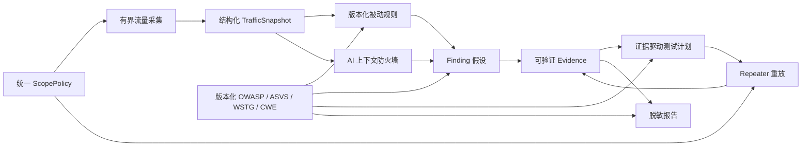
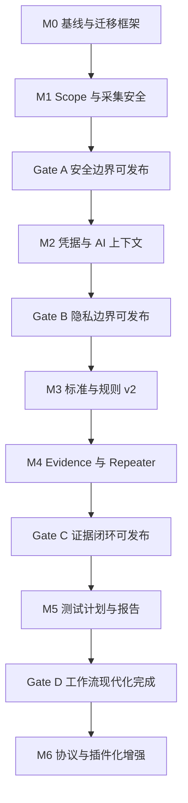

# RustForge 安全基础与证据闭环现代化实施计划

> 状态：Task 0.1–5.3 与第 10 节文档调整已完成，Gate A–Gate D 已通过；M6 保持为独立增强 backlog
>
> 日期：2026-07-24
>
> 范围：在保留“仅限已授权目标、全程人在回路、不自动攻击”产品红线的前提下，升级 Scope、流量采集、AI 隐私、规则、知识库、任务计划、Repeater、Finding 与报告。
>
> **开发态兼容策略：项目尚未发布。本计划执行期间只支持当前代码定义的最新数据模型，不实现任何旧应用版本、旧开发数据库或旧接口的兼容、迁移、回填、双写、dual-read、legacy 字段及兼容 fixture。Schema 和前后端接口随任务原子更新；已有开发数据需要时直接重建。首次公开发布后如需兼容升级，必须另立迁移计划，不能从本计划推导兼容义务。**

## 1. 目标

把当前“可运行的教学型 MVP”演进为一套可持续升级、可解释、可复核、可迁移的安全测试工作台：

1. 所有可能向目标发包的路径统一经过后端 Scope 授权。
2. 流量采集在未知长度、分块传输和解压场景下仍有明确内存上限。
3. 敏感数据默认不离开本机；每次 AI 调用可预览、可追溯、可复现。
4. 安全标准和规则均有明确版本、来源、证据位置和兼容策略。
5. Finding 不再只是文字结论，而是能关联流量、重放结果和人工复核记录的证据实体。
6. 静态 PTT 升级为增量、可保留人工修改的测试计划。
7. Repeater、Finding、任务计划和报告形成完整证据闭环。

## 2. 不在本轮范围

- 不实现无人值守扫描、自动利用或多 Agent 自主攻击。
- 不直接执行来自第三方规则包的任意脚本。
- 不在首轮加入云端规则市场或在线自动更新规则。
- 不一次性支持 WebSocket、gRPC、GraphQL、SSE 等全部协议。
- 不立即重写前端框架或追逐所有依赖的大版本升级。
- 不把 Vulnhuntr 式源码分析强行并入当前黑盒 HTTP 流程。

## 3. 必须保持的产品红线

- 没有当前项目或 Scope 为空时，不解密、不记录、不重放。
- 所有主动网络请求均由用户明确触发。
- AI、规则产生的是“待验证假设”，不能自动标记为已确认漏洞。
- 首次公开发布前不承担旧应用版本或旧开发数据库兼容；不得为保留开发态数据引入 legacy 分支。首次公开发布后的数据保留与升级策略另立计划。
- 敏感内容默认采用最小披露原则，报告默认导出脱敏版本。
- 每个阶段都必须独立可测试、可回滚，不能用一次大提交完成全部重构。

## 4. 目标架构

核心对象及职责：

| 对象                | 职责                               | 不承担的职责           |
| ----------------- | -------------------------------- | ---------------- |
| `ScopePolicy`     | 规范化目标、判断请求是否获授权、记录判定原因           | 不依赖前端提示保证安全      |
| `TrafficSnapshot` | 保存有界、结构化、带截断状态的 HTTP 证据          | 不把截断内容伪装成完整正文    |
| `AnalysisRun`     | 记录一次 AI 调用的模型、提示词、输入哈希、脱敏清单和校验结果 | 不直接代表已确认 Finding |
| `RuleEvaluation`  | 记录规则版本、命中字段、证据片段和指纹              | 不重复创建相同 Finding  |
| `Finding`         | 表达一个待验证或已确认的问题身份                 | 不直接复制大量原始敏感数据    |
| `Evidence`        | 引用流量或 Repeater 运行并保存脱敏快照、观察结果与哈希 | 不允许无来源的“已验证”状态   |
| `TestPlan`        | 组织假设、测试、依赖、状态和完成证据               | 不自动执行攻击步骤        |

## 5. 执行顺序与发布闸门

- **Gate A**：Repeater 无法越过 Scope；未知长度正文不会造成无界内存增长。
- **Gate B**：API Key 不返回前端；AI 默认输入经过结构化脱敏并可预览。
- **Gate C**：规则/AI 假设能够通过 Repeater 运行形成可追溯证据并去重。
- **Gate D**：计划增量更新且不覆盖人工进度；报告只引用真实证据。

建议每个 Task 独立提交或独立 PR。前一 Gate 未通过前，不启动依赖它的后续产品功能。

---

## M0：基线、质量门禁与数据库迁移

### Task 0.1：固定可重复的质量基线

**优先级：** P0

**依赖：** 无

**文件：**

- Modify: `package.json`
- Create: `.github/workflows/ci.yml`
- Modify: 当前触发 `cargo fmt` / `cargo clippy` 失败的 Rust 文件，仅做等价整理
- Create: `docs/architecture/0001-modernization-guardrails.md`

**步骤：**

- [x] 在 `package.json` 增加稳定的 `test`、`typecheck`、`check` 脚本。
- [x] 单独修正现有格式化差异和 4 项 Clippy 警告，不混入功能修改。
- [x] 新建 PR 级 CI，固定 Rust toolchain、Node 与 pnpm 版本。
- [x] CI 依次运行格式、Clippy、Rust 测试、前端单测、TypeScript 和生产构建。
- [x] CI 中不读取真实 API Key、不访问真实目标、不安装根证书。
- [x] 记录当前产品红线、兼容范围和本计划采用的术语。

**验收：**

- [x] `cargo fmt --manifest-path src-tauri/Cargo.toml --all -- --check`
- [x] `cargo clippy --manifest-path src-tauri/Cargo.toml --all-targets -- -D warnings`
- [x] `cargo test --manifest-path src-tauri/Cargo.toml --all-targets`
- [x] `pnpm exec tsc --noEmit`
- [x] `pnpm test`
- [x] `pnpm build`
- [x] CI 配置不依赖网络凭据；本地等价命令全部通过。

### Task 0.2：建立版本化数据库迁移

**优先级：** P0

**依赖：** Task 0.1

**文件：**

- Create: `src-tauri/src/storage/migrations.rs`
- Create: `src-tauri/src/storage/migrations/`
- Modify: `src-tauri/src/storage/db.rs`
- Modify: `src-tauri/src/storage/mod.rs`

**设计：**

- 把当前无版本 schema 识别为 `v1`。
- 使用 `PRAGMA user_version` 保存当前版本。
- 每个迁移在独立事务中执行；失败时不得留下半迁移状态。
- 项目尚未发布，不实现历史发布版/旧开发库兼容、旧库 fixture 或迁移前备份；本任务建立的迁移框架不构成后续兼容承诺。
- 当前无版本开发库只有在执行幂等 v1 DDL 后通过结构与完整性检查，才原地标记为 v1。
- schema 异常或版本高于应用支持范围时明确失败，不自动删除、降级或猜测修复。
- 本计划内后续 schema 变化直接更新当前基线 schema 和全部调用方，不新增 `v1 → v2 → ...` 兼容链。首次公开发布后的变化再从发布时 schema 起建立升级链与备份策略。

**步骤：**

- [x] 将内联 `SCHEMA` 拆为不可变的 v1 SQL 和按版本排序的迁移函数。
- [x] 对无 `user_version` 的当前开发数据库执行结构、索引、SQLite 与外键完整性检查后标记为 v1。
- [x] 在创建连接池前用独立连接完成迁移，迁移失败时不启动应用。
- [x] 所有迁移保证幂等：已完成版本不得重复执行。
- [x] 对不受支持的 schema 版本保留显式拒绝分支，不提前创建尚未使用的表。

**验收：**

- [x] 空数据库可直接初始化到最新版本。
- [x] 当前无版本开发库可标记为 v1，已有数据保持不变。
- [x] 连续打开数据库两次不会重复执行迁移。
- [x] 人为制造中途 SQL 错误时，版本号和数据均回到迁移前状态。
- [x] 畸形 schema、外键损坏和高于应用版本的数据库均被拒绝且不改写版本号。

---

## M1：Scope 授权与有界流量采集

### Task 1.1：提取统一的后端 `ScopePolicy`

**优先级：** P0

**依赖：** Task 0.2

**文件：**

- Create: `src-tauri/src/authorization/mod.rs`
- Create: `src-tauri/src/authorization/scope.rs`
- Modify: `src-tauri/src/lib.rs`
- Modify: `src-tauri/src/proxy/interceptor.rs`
- Modify: `src-tauri/src/commands.rs`
- Modify: `src-tauri/src/storage/models.rs`
- Modify: `src-tauri/Cargo.toml`
- Modify: `src/api/tauri.ts`
- Modify: `src/stores/repeater.ts`
- Modify: `src/views/RepeaterView.vue`

**设计：**

- 代理和 Repeater 必须调用同一套 host 规范化与 Scope 判定代码。
- `replay_request` 必须接收 `project_id`，后端验证项目存在且 URL 属于其 Scope。
- 判定结果返回稳定错误码，如 `NO_ACTIVE_PROJECT`、`EMPTY_SCOPE`、`OUT_OF_SCOPE`、`INVALID_URL`。
- 只允许 `http` 和 `https`；拒绝 URL userinfo、无 host URL 和不支持的 scheme。
- 域名比较统一处理大小写、尾随点、通配符、IPv4/IPv6；IDN 统一转换为 ASCII 形式。
- URL/IDN 解析使用显式声明的库依赖，不依赖 reqwest 的传递依赖。
- 当前阶段继续保持“不自动跟随重定向”。未来如允许重定向，每一跳必须重新过 Scope。
- 私网、loopback 等目标不是一律禁止，但必须由项目 Scope 显式列出。

**步骤：**

- [x] 把 `host_matches_scope` 和 scope 规范化从代理模块移入 `authorization`。
- [x] 为授权结果定义包含原因和规范化目标的结构体。
- [x] 修改代理拦截路径使用新策略，确保原有行为不回退。
- [x] 修改 Repeater Tauri 命令，删除无项目上下文的调用方式。
- [x] 前端发送当前项目 ID；没有项目或 Scope 不匹配时禁用发送并展示后端原因。
- [x] 为重放运行预留 Scope 判定快照字段，后续写入 Evidence。

**测试：**

- [x] 精确域名、通配子域、apex、大小写、尾随点。
- [x] IPv4、IPv6、显式端口、非法端口。
- [x] IDN/Punycode 等价性。
- [x] localhost、私网、链路本地地址只有显式在 Scope 时才允许。
- [x] URL 中 `example.com@evil.test` 等混淆形式不得误判。
- [x] 代理与 Repeater 对同一输入的判定结果完全一致。
- [x] Repeater 越界时确认没有实际网络连接发生。

### Task 1.2：有上限的流式捕获和解压

**优先级：** P0

**依赖：** Task 1.1

**文件：**

- Create: `src-tauri/src/proxy/body_capture.rs`
- Modify: `src-tauri/src/proxy/interceptor.rs`
- Modify: `src-tauri/src/storage/db.rs`
- Modify: `src-tauri/src/storage/models.rs`
- Modify: `src/api/tauri.ts`
- Modify: `src/views/TrafficView.vue`
- Modify: `src-tauri/tests/proxy_mitm.rs`

**新增字段：**

- `req_wire_size` / `resp_wire_size`
- `req_captured_size` / `resp_captured_size`
- `req_truncated` / `resp_truncated`
- `req_decode_status` / `resp_decode_status`

旧的 `req_size` / `resp_size` 不因兼容目的保留；本任务直接用语义明确的新字段替换，并同步修改数据库、Rust 模型、Tauri API、前端与测试。

**技术验证后锁定的语义与上限：**

- 每个请求/响应的线缆捕获上限 `MAX_WIRE_CAPTURE_BYTES = 1 MiB`；超过后继续逐帧转发，只停止增长捕获缓冲。
- 每个请求/响应的解压后捕获上限 `MAX_DECODED_CAPTURE_BYTES = 1 MiB`；gzip、deflate、br 的每层解码都受此上限约束。
- `*_wire_size` 是实际从 Body 数据帧观察到的总字节数，绝不采用 `Content-Length` 代替；`*_captured_size` 是最终入库（可能已解压）字节数。
- `*_truncated` 同时覆盖线缆上限、解压上限、读取错误和未完整结束；`*_decode_status` 使用固定枚举值区分文本、非文本、解码失败、不支持编码和流状态。
- Header JSON 的单值保持字符串，重复值使用有序数组；`Set-Cookie` 不允许逗号或换行合并。

**步骤：**

- [x] 先写技术验证，确认 hudsucker/hyper 可使用 tee body 在转发同时有界捕获。
- [x] 捕获逻辑按字节流计数，只保存配置上限内的数据，剩余内容继续转发。
- [x] 同时限制压缩前和解压后大小，防止压缩炸弹。
- [x] 未知 `Content-Length`、chunked、错误长度均走相同上限。
- [x] 对截断、解码失败和非文本内容设置显式状态。
- [x] UI 在正文区域展示“已截断/解码失败”，AI 与规则也能读取该状态。
- [x] 保留重复响应头，不再把多个 `Set-Cookie` 合并成一个值。

**测试：**

- [x] 大 `Content-Length` 请求和响应。
- [x] 无 `Content-Length` 的 chunked 请求和响应。
- [x] 声明长度小于实际长度。
- [x] gzip、deflate、br 正常解压与解压炸弹。
- [x] 二进制正文、无效 UTF-8、空正文。
- [x] 多个 `Set-Cookie` 可逐项读取。
- [x] 测试证明峰值内存随捕获上限增长，而不随完整响应大小增长。

### Gate A 验收

- [x] 所有主动发包入口均经 `ScopePolicy`。
- [x] Scope 外 Repeater 请求在 socket 建立前失败。
- [x] 代理对超大或未知长度正文不会无界缓存。
- [x] 现有 MITM 集成测试和新边界测试全部通过。
- [x] 当前基线 schema 创建的新项目和流量可正常展示；不验收旧开发数据库升级。

---

## M2：凭据安全与 AI 上下文防火墙

### Task 2.1：API Key 与 CA 私钥保护

**优先级：** P0

**依赖：** Task 0.2

**文件：**

- Create: `src-tauri/src/secrets.rs`
- Modify: `src-tauri/src/commands.rs`
- Modify: `src-tauri/src/lib.rs`
- Modify: `src-tauri/src/proxy/ca.rs`
- Modify: `src-tauri/Cargo.toml`
- Modify: `src/stores/settings.ts`
- Modify: `src/api/tauri.ts`
- Modify: `src/views/SettingsView.vue`
- Modify: `src-tauri/tauri.conf.json`

**设计：**

- 使用系统凭据库保存 provider API Key；SQLite 只存 provider、Base URL、模型及非敏感选项。
- `get_all_settings` 永远不返回秘密，只返回 `has_api_key` 等布尔状态。
- 获取模型和 AI 调用均由 Rust 后端自行读取秘密，前端不再把 Key 作为参数传回。
- 不实现旧版明文 Key 迁移；开发态数据库直接重建，当前版本从首次写入起只使用凭据库。
- CA 私钥继续保存在本机，但私钥文件和目录必须使用仅当前用户可读的权限/ACL，采用原子写入，并在内存对象释放时清零 PEM 缓冲。

**步骤：**

- [x] 封装 `SecretStore` trait，便于用内存实现做单元测试。
- [x] 接入 Windows Credential Manager、macOS Keychain、Linux Secret Service 支持。
- [x] 添加设置/替换/删除 Key 的专用 Tauri 命令。
- [x] 移除通用设置接口对敏感 key 的读取能力。
- [x] 创建或加载 CA 时验证私钥文件所有者和权限；权限过宽时先收紧，无法收紧则停止代理启动并给出修复说明。
- [x] CA 证书导出功能继续只导出公钥证书，任何命令和日志都不得返回私钥路径或内容。
- [x] 私钥首次生成采用安全临时文件、同步落盘和原子重命名，避免崩溃留下空文件或部分 PEM。
- [x] 为 Tauri 配置最小可用 CSP，并验证生产包中生效。
- [x] 对错误日志做秘密过滤，禁止输出 Authorization 和 API Key。

**验收：**

- [x] 前端状态、Tauri IPC 返回值和日志中均找不到完整 API Key。
- [x] 删除 Key 后凭据库和 UI 状态一致。
- [x] 新生成和既有 CA 私钥权限检查通过；普通其他用户无法读取。
- [x] CA 导出目录中不存在私钥副本。
- [x] CSP 不影响本地 UI、更新检查和系统浏览器打开外链。

**执行证据（2026-07-24）：**

- `keyring 4.1.5` 的 v1 后端负责 Windows Credential Manager、macOS Keychain 和 Linux Secret Service；应用代码只依赖 `SecretStore`。
- 单元测试覆盖秘密写入/替换/幂等删除、只读布尔状态、明文设置拒绝、日志过滤、Windows 当前 SID 独占 DACL、CA 原子生成/重载及仅证书导出。
- `cargo clippy --all-targets -- -D warnings`、`cargo test --all-targets`、`pnpm test`、`pnpm typecheck`、`pnpm build` 均通过。
- `pnpm tauri build --no-bundle` 和 `cargo build --release` 成功生成生产二进制；自动测试断言生产 CSP 的前端网络仅允许 Tauri IPC，开发 CSP 仅额外允许本机 Vite/HMR。

### Task 2.2：结构化脱敏与 AI 发送预览

**优先级：** P0

**依赖：** Task 1.2、Task 2.1

**文件：**

- Create: `src-tauri/src/ai/context.rs`
- Create: `src-tauri/src/ai/redaction.rs`
- Create: `src-tauri/src/ai/validation.rs`
- Modify: `src-tauri/src/ai/prompts.rs`
- Modify: `src-tauri/src/ai/analyzer.rs`
- Modify: `src-tauri/src/ai/client.rs`
- Modify: `src-tauri/src/commands.rs`
- Modify: `src-tauri/src/storage/db.rs`
- Modify: `src-tauri/src/storage/models.rs`
- Modify: `src/api/tauri.ts`
- Create: `src/components/AiContextPreviewDialog.vue`
- Modify: `src/components/AnalysisPanel.vue`
- Modify: `src/views/SettingsView.vue`

**默认策略：**

- URL 保留 scheme/host/path，查询参数值默认遮盖。
- Authorization、Cookie、Set-Cookie 和常见秘密头默认遮盖。
- JSON、表单和 multipart 按字段名、值格式和高熵检测脱敏。
- 请求/响应正文分别设置上限，总上下文也有硬上限。
- 二进制、已截断或解码失败正文默认不发送。
- 每次分析前可查看最终发送内容；放宽策略必须由用户显式操作。

**技术验证后锁定的语义与上限：**

- 安全默认值为请求正文 `8 KiB`、响应正文 `12 KiB`、单次消息 `32 KiB`；后端硬上限分别为 `24 KiB`、`24 KiB`、`64 KiB`，单次消息下限为 `16 KiB`。
- 超过安全默认值、关闭任一遮盖项，或允许截断/二进制/解码异常正文，均视为放宽策略并要求二次确认；正文状态的放宽开关互不替代。
- 预览同时列出首次消息、固定校验重试消息、Provider 目标、模型和可选 JSON Schema。长度前缀 SHA-256 哈希绑定这些内容、提示词版本和 policy；发送前后端从数据库真值重新构建并比对。
- 所有 HTTP 原始值都位于 `UNTRUSTED_HTTP_DATA` 标记内，潜在闭合标记会被转义；正文被策略截断时在发送内容中加入明确的 `OMITTED` 标记。
- `analysis_runs` 保存 Provider ID/Base URL、模型、提示词、输入哈希、policy、manifest、token、Schema 模式、校验结果和原始输出哈希。无效运行可审计但不能创建 Finding；删除流量后运行追溯仍保留。

**步骤：**

- [x] 定义 `AiDataPolicy` 和 `RedactionManifest`。
- [x] 先解析再脱敏，无法解析时采用更保守的文本扫描。
- [x] 把不可信 HTTP 内容作为明确标记的数据块传入，系统提示词禁止遵循其中指令。
- [x] 不使用“已脱敏”固定文案；由 manifest 决定 UI 展示。
- [x] 新建 `analysis_runs`，记录 provider、model、prompt ID/version、输入哈希、策略、manifest、token 和校验结果。
- [x] 为支持结构化输出的 provider 增加 JSON Schema；其他 provider 使用同一后端验证器。
- [x] 校验假设数量、severity 枚举、CWE/OWASP 引用、字符串长度和证据引用。
- [x] 模型声称的证据必须能映射到发送给模型的字段或片段，否则降级为低置信度并标记 `ungrounded`。
- [x] 自定义提示词增加版本、复制、回滚和恢复默认功能。

**测试语料：**

- [x] URL query 中的 token/password。
- [x] JSON、嵌套 JSON、表单、Cookie、JWT、Bearer、Basic Auth。
- [x] PEM 私钥、云凭据格式、高熵随机串。
- [x] 正常业务 ID 和哈希，防止全部被误遮盖。
- [x] 响应正文中包含“忽略系统指令”等提示注入文本。
- [x] 超长正文、截断正文和二进制正文。
- [x] 无效 severity、超量 hypotheses、伪造 CWE/OWASP、空证据。

**执行证据（2026-07-27）：**

- Rust 单元测试 `93 passed`，MITM 集成测试 `4 passed`；覆盖结构化/保守脱敏、提示注入边界、正文状态与硬上限、预览哈希、Schema、统一后端校验、grounding、提示词版本及数据库约束。
- `cargo fmt --all -- --check`、`cargo clippy --all-targets -- -D warnings`、`cargo +1.88.0 check --all-targets` 均通过。
- 前端测试 `18 passed`，`pnpm typecheck` 和 `pnpm build` 通过；`pnpm check` 整体通过。
- 数据库测试证明无效 `analysis_run` 无法创建 AI Finding，提示词历史不可更新/删除，清除流量后 Finding 仍能追溯到对应运行。

### Gate B 验收

- [x] API Key 仅存在于系统凭据库和后端内存。
- [x] 默认 AI 请求不含原始秘密、完整 Cookie 或查询值。
- [x] 用户可看到最终发送内容及脱敏摘要。
- [x] 每个 AI 结果都能追溯到模型、提示词版本和输入哈希。
- [x] 结构化输出校验失败不会创建 Finding。

---

## M3：版本化知识库与声明式规则 v2

### Task 3.1：版本化安全标准知识包

**优先级：** P1

**依赖：** Task 0.2

**文件：**

- Create: `src-tauri/src/knowledge/model.rs`
- Create: `src-tauri/src/knowledge/registry.rs`
- Create: `src-tauri/src/knowledge/packs/owasp-top10-2021.json`
- Create: `src-tauri/src/knowledge/packs/owasp-top10-2025.json`
- Create: `src-tauri/src/knowledge/packs/owasp-api-top10-2023.json`
- Create: `src-tauri/src/knowledge/packs/asvs-5.0.0.json`
- Create: `src-tauri/src/knowledge/packs/wstg-4.2.json`
- Modify: `src-tauri/src/knowledge/mod.rs`
- Modify: `src-tauri/src/storage/db.rs`
- Modify: `src-tauri/src/storage/models.rs`
- Modify: `src/api/tauri.ts`
- Modify: `src/components/KnowledgeCard.vue`

**设计：**

- 标准引用使用 `{ framework, version, id }`，显示标题是派生数据。
- 安装包内置固定版本 JSON，不在运行时拉取互联网内容。
- 每个知识包记录来源 URL、发布日期、许可证和内容哈希。
- 2021 引用继续可读；不得把未知年份强制改写为 2021。
- CWE 使用明确版本或数据发布日期，并保留原始 CWE ID。

**技术验证后锁定的实现语义：**

- 内置 OWASP Top 10 2021/2025 与 API Top 10 2023 的全部十个分类；ASVS 5.0.0、WSTG 4.2 和 CWE 4.20 提供当前工作流所需的精选核心知识卡。未收录条目保持 unknown，不以近似条目替代。
- `findings.standard_references` 与 `task_nodes.standard_references` 保存结构化 JSON 数组；标题、展示键和修复建议仅从已固定的知识包派生。按开发态兼容策略移除旧 `owasp` / `cwe` 字段，已有开发数据库需要重建。
- 内容哈希为 `entries` 规范 JSON 的 SHA-256。启动校验同时检查 schema 版本、必填元数据、HTTPS 来源/许可证 URL、条目 ID 格式、包版本与全局引用唯一性、跨引用完整性和哈希。
- 应用启动、AI/规则写入、数据库读取和知识卡查询共用同一注册表；未知版本或编号明确失败，不做默认年份、模糊匹配或运行时网络回退。

**步骤：**

- [x] 定义知识包 schema 和启动时校验器。
- [x] 用项目自有表述编写简洁说明，避免复制大段第三方文本。
- [x] 当前模型只写入结构化引用；无法识别的引用明确报错或标记 unknown，不建立 legacy 字段。
- [x] Finding 和 Task 支持多个标准引用。
- [x] UI 按版本显示并能区分同一编号在不同年份的含义。

**验收：**

- [x] `A03:2021` 与 `A03:2025` 返回不同且正确的知识卡。
- [x] 所有包通过 schema、唯一 ID、引用完整性和内容哈希测试。
- [x] 当前模型创建的 Finding 引用在读取、展示和报告中语义一致。
- [x] 未知标准引用不会被静默映射。

**执行证据（2026-07-27）：**

- 六个固定版本知识包共包含 93 张项目自有表述的知识卡；除计划列出的五个 OWASP 包外，按设计补充 CWE 4.20 包，并为每个包固定来源、发布日期、许可证和内容哈希。
- 注册表测试证明 `A03:2021` 为“注入”、`A03:2025` 为“软件供应链失效”，且未知 `A03:2024`、未知 CWE 编号和被篡改的包均被明确拒绝。
- AI Schema/提示词/后端校验、14 条现有规则、Finding 与 Task 落库读取、Tauri IPC、Finding/Task UI 知识卡和 Markdown 报告已统一为多值 `StandardReference`；任务测试覆盖两个标准引用的数据库往返，报告测试覆盖版本化引用与派生修复建议。
- `cargo fmt --all -- --check`、`cargo clippy --all-targets -- -D warnings`、`cargo test --all-targets` 均通过；Rust 为 `106 passed` 单元测试与 `4 passed` MITM 集成测试。前端 `pnpm check` 整体通过，包含 `18 passed`、TypeScript 检查和生产构建。

**后续优化（Task 3.1/3.2 代码评审补充，非阻塞）：**

- [x] `registry.rs` 的 `RegisteredEntry` 目前为每个条目克隆整份 `KnowledgePack`（含该包全部 entries），内存随条目数近似二次方增长。改为存 `pack_index` / `Arc<KnowledgePack>` 或 `(pack_idx, entry_idx)` 索引，纯内部重构、不改外部行为与现有测试。当前六包 93 卡量级可接受，若未来扩到全量 CWE 需先做此项。
- [x] `KnowledgePack::computed_content_sha256` 用 `serde_json::to_vec(&entries)`，依赖结构体字段顺序而非规范化 JSON（非 RFC 8785）。当前 entries 全为定序结构体，安全；补一条约束注释“不得在 entries 内引入无序容器（如 `serde_json::Map`）”，避免以后哈希不稳定。
- [x] 知识库对“编号非法”与“编号合法但精选包未收录”统一报 `UnknownReference`。可新增 `not_in_pack` 状态与 UI 提示“未收录，不影响判定”，改善差异化路线下的可读性；须保持“绝不把未知编号静默映射到已知条目”这条红线不变。

**后续优化执行证据（2026-07-27）：**

- 注册表改为 `StandardReference → (pack_idx, entry_idx)`，93 个条目不再各自克隆整包；知识卡仍在查询边界按需派生，外部接口语义不变。
- `KnowledgeEntry` 明确禁止无序容器进入哈希输入，并用字段顺序/重复序列化测试固定当前非 RFC 8785 编码约束。
- 查询接口返回 `cards + unresolved`；合法但精选包未收录的引用显示 `not_in_pack`，非法编号显示 `invalid`，两者都不会映射到近似知识卡；严格写入校验仍拒绝两种未知引用。

### Task 3.2：规则 schema、加载器与结构化提取器

**优先级：** P1

**依赖：** Task 1.2、Task 3.1

**文件：**

- Create: `src-tauri/src/rules/schema.rs`
- Create: `src-tauri/src/rules/loader.rs`
- Create: `src-tauri/src/rules/extractors.rs`
- Create: `src-tauri/src/rules/fingerprint.rs`
- Create: `src-tauri/src/rules/packs/builtin-v1.json`
- Modify: `src-tauri/src/rules/engine.rs`
- Modify: `src-tauri/src/rules/builtin.rs`
- Create: `src-tauri/tests/fixtures/rules/`

**首版规则能力：**

- 目标：method、URL、query、request/response header、单个 cookie、正文、状态码、content type。
- 提取器：query、form、JSONPath 子集、cookie、JWT 元数据和文本片段。
- 运算符：equals、contains、regex、exists、missing、numeric comparison、all/any/not。
- 限制：最大规则数、最大正则长度、最大执行时间、正文截断感知。
- 禁止：文件访问、网络访问、进程启动和任意脚本。

**技术验证后锁定的实现语义：**

- 规则包 schema 固定为 v1，并对规则包、规则、条件和提取器启用严格未知字段拒绝。加载器只把传入的 JSON 编译为只读条件 AST，不提供文件、网络、进程、动作或脚本节点；解析、schema、标准引用或资源上限校验失败时仅将对应包标记为 `Disabled`，以脱敏原因写入诊断，代理继续运行。
- 每包最多 256 条规则，条件树深度最多 16 层，单选择器最多 256 个候选，JSONPath 最多 12 段；单流量规则包求值预算为 50 ms，命中证据最多 160 个字符。正则源码最多 512 字节、语法嵌套最多 24 层、编译程序和惰性 DFA 各最多 1 MiB，并使用无回溯的 Rust `regex` 引擎。
- JSONPath 首版只接受字段和数组下标，不支持递归、通配符或过滤器；JWT 只解析 `alg`、`kid`、`iss`、`aud`、`exp`、`nbf` 等元数据，不把未验签内容当成可信声明。`ForEach` 首版仅允许 request/response cookie，并对每条 `Set-Cookie` 独立判断和产生命中。
- 最终命中身份对 `rule_id`、规范化 method/host/path 和字段路径做长度前缀编码后计算 SHA-256；`rule_version` 按 Task 3.3 决策只作为命中属性、不进入身份。查询值不参与接口身份，具体 cookie 下标和属性路径参与身份。截断正文命中标记为不完整证据，置信度硬上限为 40。
- 旧规则求值器只保留为 Task 3.3 新旧影子评测的比较基线，生产代理默认只调用声明式规则包。

**步骤：**

- [x] 定义带 `rule_id`、`version`、`source`、`severity`、`confidence`、references 的 JSON schema。
- [x] 将现有 14 条规则迁移为内置规则包。
- [x] Cookie 规则按单个 `Set-Cookie` 评价，修复全局 `must_absent` 语义。
- [x] 命中结果包含字段路径、脱敏证据片段、规则版本和稳定指纹。
- [x] 对已截断正文只能产生明确标记的低置信度结果。
- [x] 加载失败时禁用对应规则包并显示原因，不能导致代理退出。

**验收：**

- [x] 14 条旧规则都有正例、反例和边界样本。
- [x] 多 Cookie 缺少单项安全属性可被正确识别。
- [x] 相同规则包重复加载结果一致。
- [x] 恶意或超复杂 regex 受到大小和时间限制。
- [x] 规则输出能引用正确的版本化标准。

**执行证据（2026-07-27）：**

- 14 条旧规则已完整迁入 `builtin-v1.json`，生产代理改用声明式引擎；命中携带具体字段/属性路径、最长 160 字符的脱敏证据、规则版本、置信度和 64 字符十六进制 SHA-256 指纹，版本化标准引用在写入 Finding 前再次经 Task 3.1 注册表校验。
- 独立 `rules_pack` 验收测试 `9 passed`：逐条核对 14 条规则的正例、反例和边界样本，覆盖多 Cookie 分别缺少属性、Cookie 值伪装属性名、重复加载确定性、坏包隔离、截断降置信度、字段级指纹与版本化引用。
- 加载器和引擎单元测试覆盖规则数量/条件深度/JSONPath/候选数量/执行预算、超长及编译展开型正则、提取器与目标不兼容、未知标准引用、重复 ID 和 schema 版本不匹配；恶意输入均在加载或有界求值阶段被拒绝，不影响代理主链路。
- `cargo fmt --all -- --check`、`cargo clippy --all-targets -- -D warnings`、`cargo test --all-targets` 均通过；Rust 为 `139 passed` 单元测试、`4 passed` MITM 集成测试和 `9 passed` 规则包验收测试。前端 `pnpm check` 整体通过，包含 `18 passed`、TypeScript 检查和生产构建。

### Task 3.3：规则后台执行、评测与去重

**优先级：** P1

**依赖：** Task 3.2

**文件：**

- Create: `src-tauri/src/rules/worker.rs`
- Create: `src-tauri/src/rules/shadow.rs`（仅 `cfg(test)`）
- Create: `docs/architecture/rule-shadow-evaluation.md`
- Move: `src-tauri/src/rules/builtin.rs` → `src-tauri/tests/fixtures/rules/legacy_v1.rs`（冻结的 test-only 基线）
- Modify: `src-tauri/src/proxy/interceptor.rs`
- Modify: `src-tauri/src/rules/engine.rs`（正文单次解码复用、shadow 后移除 legacy 双轨）
- Modify: `src-tauri/src/rules/fingerprint.rs`（Finding 身份语义：叠加 project、`rule_version` 不入身份）
- Modify: `src-tauri/src/storage/migrations.rs`
- Modify: `src-tauri/src/storage/migrations/v1.sql`
- Modify: `src-tauri/src/storage/models.rs`
- Modify: `src-tauri/src/commands.rs`
- Modify: `src/api/tauri.ts`
- Modify: `src/stores/findings.ts`
- Modify: `src/stores/traffic.ts`
- Modify: `src/views/FindingsView.vue`

**设计要点（来自 Task 3.1/3.2 代码评审）：**

- **规则求值必须移出代理写事务。** 当前 `interceptor.rs::store_and_emit` 在同一个 `unchecked_transaction` 内先 INSERT traffic、再 `engine::evaluate`、再 INSERT findings、最后 commit，最长 50ms 求值预算全程占用一条写连接，与本任务“不持有写事务/不等待”验收直接冲突。拆成两段：短事务先提交 traffic，再只把 `project_id + traffic_id` 投递给 `worker.rs`；worker 消费时按需读取有界快照，避免有界队列把大正文再复制 256 份。
- **Finding 指纹在引擎指纹上叠加 project，不另造一套。** Task 3.2 初版的 `fingerprint.rs` 已负责 method/host/path/field_path 规范化；Task 3.3 先按下一条决策移除 version，再对 `project_id` 与引擎命中指纹做长度前缀拼接后取 SHA-256，避免两处规范化逻辑漂移。
- **明确 `rule_version` 不进入 Finding 身份。** 当前引擎指纹把 `rule_version` 计入身份，规则包补丁级升版（1.0.0→1.0.1）会让同一端点同一字段的历史 Finding 与新命中指纹不同、去重失效并炸出重复。定为：Finding 身份只用 `rule_id`，`rule_version` 记为命中/证据属性；仅当规则语义实质变化时才启用新 `rule_id`。
- **大 body 一次解码、复用给所有规则。** 内置包有 3 条对 `response_body`、1 条对 `request_body` 的正则外加 JsonPath，当前每条规则各自 `from_utf8_lossy`、JsonPath 各自 `serde_json::from_str`。在 `engine::evaluate_pack` 入口对请求/响应正文各解码一次、JSON 各解析一次并缓存复用，避免 worker 在连续大响应下逐规则线性劣化。
- **诊断必须可见。** 坏包禁用原因、求值超时、队列丢弃目前只 `eprintln!` 到 stderr；本任务需通过 IPC 暴露给前端，配合 `rule_evaluations` 的可诊断/可重试。

**步骤：**

- [x] 拆分 `store_and_emit`：traffic 用短事务先落库并推事件；规则任务经有界 `mpsc` 投递给 `worker.rs`，`try_send` 失败即计 `dropped_evaluations` 指标，绝不 `await` 阻塞响应回调或网络转发。
- [x] `worker.rs` 用独立连接求值与写库、不持有代理写事务；`rule_evaluations` 以 `(traffic_id, pack_id, pack_version)` 为幂等键并在处理前查重，保证失败可重试、重启不重复建 Finding。
- [x] 在 `engine::evaluate_pack` 入口对请求/响应正文各解码一次、JSON 各解析一次并复用；大 body 正则沿用 Task 1.2 的截断语义，不做全量重复扫描。
- [x] `findings` 增加 `fingerprint` 列并建唯一约束；指纹 = SHA-256(project_id 与引擎命中指纹长度前缀拼接)，`rule_id` 不含 version 参与身份。
- [x] 同一指纹再次命中时追加关联 traffic 与累计计数，不重复创建 Finding；`rejected` 不因再次命中自动恢复。Evidence 关联仍按依赖留给 Task 4.1。
- [x] 新增规则诊断/包状态查询命令（Disabled 原因、超时次数、`dropped_evaluations`），在前端 Findings 可见；后台补写的 traffic rule tags 也通过增量事件实时更新。
- [x] 以 test-only shadow mode 同时运行 `legacy_evaluate` 与 v2，把差异（仅 v2 / 仅 legacy / 两者命中）写入内存临时表；人工标注 fixtures 逐规则计算 TP、FP、FN 和跳过原因。
- [x] v2 通过 shadow 基线后成为唯一生产引擎；项目尚未公开发布，不虚构“已稳定一个公开发布周期”，而以预发布质量闸门完成切换。`engine.rs` 的 legacy 路径、生产 `builtin.rs` 与 `LEGACY_RULES` 已删除，旧语义只冻结为 test-only fixture。

**验收：**

- [x] 规则处理不持有代理数据库写事务；求值全程不阻塞网络转发。
- [x] 大量重复请求只产生一个 Finding，并能看到多条关联流量。
- [x] 队列满时有明确降级和指标（`dropped_evaluations` 可见），不阻塞转发。
- [x] 规则包升补丁版本后，同一端点同一字段不产生重复 Finding。
- [x] 大 body 连续响应下，worker 求值不因逐规则重复解码/解析而线性劣化。
- [x] 坏包、超时、队列丢弃的诊断可在前端查询到。
- [x] shadow mode 差异经过人工审阅并形成记录。

**执行证据（2026-07-27）：**

- `store_and_emit` 只完成 traffic INSERT、释放连接并推送 `traffic:new`，随后才 `try_send`；容量 256 的同步队列元素固定为两个 `i64` 身份，在满载/断连测试中均立即返回并累计丢弃数。worker 在独立 OS 线程按需读取流量快照，读取连接在规则求值前释放，写入时才开启独立 `IMMEDIATE` 事务。
- 数据库测试覆盖同包同流量幂等、失败事务回滚后可重试、64 条查询值不同但 route 相同的流量只生成一个 Finding、64 条 traffic 关联、`rejected` 状态保持，以及 `builtin@1.0.0 → 1.0.1` 后不重复建 Finding；`finding_rule_hits` 为每次有效求值保留包/规则版本、命中字段、脱敏证据、置信度和指纹。
- 请求/响应 body、JSON、header 与 Cookie 都在单次包求值上下文中缓存复用；1 MiB 正文测试验证命中结果不变，截断语义继续限制证据完整性和置信度。
- Findings 页面展示 worker 状态、队列深度、完成/丢弃/超时/失败计数、规则包 Disabled 原因、最近 20 次持久化求值、同一 Finding 的关联流量及逐次规则命中审计；`finding:updated` 与 `traffic:tags` 事件实现增量刷新。
- 56 条人工标注 shadow 样本的 v2 汇总为 TP/FP/FN = `30/0/0`，冻结 v1 为 `26/1/4`；2 条未标注跨规则命中按明确原因跳过。三条差异规则均为人工确认的 v2 改进，记录见 `docs/architecture/rule-shadow-evaluation.md`。
- `cargo fmt --all -- --check`、`cargo clippy --all-targets -- -D warnings`、`cargo test --all-targets` 和 `pnpm check` 均通过；Rust 为 `154 passed` 单元测试、`4 passed` MITM 集成测试和 `8 passed` 规则包验收测试，前端为 `18 passed`、TypeScript 检查与生产构建通过。

---

## M4：Finding、Evidence 与 Repeater 工作台

### Task 4.1：建立 Finding 身份、状态历史与 Evidence 模型

**优先级：** P1

**依赖：** Task 2.2、Task 3.3

**文件：**

- Create: `src-tauri/src/evidence/mod.rs`
- Create: `src-tauri/src/evidence/model.rs`
- Create: `src-tauri/src/evidence/service.rs`
- Modify: `src-tauri/src/storage/migrations/v1.sql`
- Modify: `src-tauri/src/storage/migrations.rs`
- Modify: `src-tauri/src/storage/models.rs`
- Modify: `src-tauri/src/commands.rs`
- Modify: `src-tauri/src/lib.rs`
- Modify: `src-tauri/src/report.rs`
- Modify: `src-tauri/src/rules/worker.rs`
- Modify: `src/api/tauri.ts`
- Modify: `src/stores/findings.ts`
- Modify: `src/views/FindingsView.vue`
- Create: `src/components/EvidencePanel.vue`

**新增数据：**

- `findings.updated_at`、`analyst_notes`（`fingerprint`、累计命中数与关联 traffic 已由 Task 3.3 提前交付）
- `finding_events`：状态、严重性和人工备注变化历史
- `evidence`：来源类型、来源 ID、观察结果、脱敏快照、内容哈希、创建者和时间
- `finding_evidence`：Finding 与 Evidence 多对多关系
- 计划草案中的 `finding_references` 不再另建：Task 3.1 已将 `findings.standard_references` 锁定为结构化、版本固定的 JSON 数组；按开发态“不双写”策略继续以该字段为唯一真源

**状态规则：**

- `pending → confirmed` 必须至少关联一条人工接受的 Evidence。
- `pending → rejected` 必须填写简短原因。
- 规则或 AI 后续再次命中不得自动覆盖人工状态。
- severity 与 confidence 分离；confidence 不是风险等级。

**技术验证后锁定的实现语义：**

- `finding_events` 由数据库触发器为每个新 Finding 自动写入 `created`；状态、severity、人工备注以及 Evidence 接受/撤销都必须先追加匹配事件，数据库触发器会拒绝绕过审计的直接更新。事件、Evidence 本体以及 Finding 存续期间的 Evidence 关联不可改写或单独删除，项目/Finding 生命周期级联仍可执行。
- “人工接受”是 `finding_evidence` 关系上的判断，不污染可被多个 Finding 复用的 Evidence 本体。新关联固定从未接受开始；接受说明、操作者和时间戳只能随一次匹配审计事件的状态转换原子写入，`linked_at` 永久不可改写；已确认 Finding 不能撤销最后一条已接受 Evidence。
- traffic Evidence 只保存方法、脱敏 URL/Header、最多各 8 KiB 的脱敏文本正文、捕获/截断元数据和脱敏清单；二进制正文不进入快照。analysis run Evidence 只保存 provider/model/prompt、输入/输出哈希、策略、脱敏清单、校验与 token 元数据，不复制模型原始输出。快照整体上限 64 KiB，内容哈希为快照规范 JSON 的 SHA-256。
- `source_id` 是受服务校验的多态来源标识，不对可删除来源建立外键。删除 traffic 后 Evidence 的原来源 ID、观察结果、快照和哈希继续保留，读取结果明确标记 `source_available = false`。
- `replay_run` 已固定在 schema、Rust/TypeScript 来源类型和服务分派契约中；Task 4.2 创建 `replay_runs` 前，服务明确拒绝引用不存在的重放运行，不创建占位表或伪记录。Task 4.2 将沿用该入口接入实际运行。

**步骤：**

- [x] 在 Task 3.3 已有 Finding 指纹上补充初始状态事件；直接更新预发布 v1 基线，不回填旧开发数据。
- [x] traffic、analysis run 已可直接引用；replay run 已建立来源契约并由 Task 4.2 在实际表创建后接入，不重复复制原始大正文。
- [x] Evidence 保存稳定 SHA-256 和用于报告的默认脱敏、有界快照。
- [x] 所有人工状态、severity、备注和 Evidence 接受状态修改使用事务，并追加数据库保护的不可变事件。
- [x] `EvidencePanel` 展示“假设来源、实际证据、人工结论”三个区域及按序历史。

**验收：**

- [x] 无人工接受 Evidence 的 Finding 不能被标记 confirmed；只有未接受 Evidence 也不能绕过。
- [x] rejected Finding 再次命中不会被恢复成 pending。
- [x] 删除原 traffic 后保留 Evidence 脱敏快照、来源 ID 和哈希，并有测试覆盖。
- [x] Finding 历史按 `created_at, id` 稳定排序，可完整重放创建、severity、备注、Evidence 判断与状态变化。

**执行证据（2026-07-27）：**

- 新增 7 条 Evidence 服务测试，覆盖无证据/只有未接受证据不能确认、误报原因必填、直接 SQL 绕过审计被拒绝、事件不可改写/单独删除、已确认状态保留最后证据、跨项目来源拒绝、analysis run 引用、相同脱敏快照哈希稳定，以及删除 traffic 后快照继续可读。
- Task 3.3 的 64 条重复流量与规则包补丁版本测试改走正式人工状态事务服务，继续证明 `rejected` 不被后续命中覆盖；报告 fixture 也必须通过“创建 Evidence → 人工接受 → 确认”才能生成已确认章节。
- Findings 页面展开行使用稳定 `row-key`，EvidencePanel 可从首次/关联 traffic 或 AI analysis run 创建证据、查看脱敏快照与哈希、接受/撤销证据、维护独立 severity 和人工备注，并按时间线查看全部审计事件。
- `cargo fmt --all -- --check`、`cargo clippy --all-targets -- -D warnings`、`cargo test --all-targets --no-fail-fast` 和 `pnpm check` 均通过；Rust 为 `165 passed` 单元测试、`4 passed` MITM 集成测试和 `8 passed` 规则包验收测试，前端为 `21 passed`、TypeScript 检查与生产构建通过。

### Task 4.2：持久化 Repeater 会话与运行

**优先级：** P1

**依赖：** Task 1.1、Task 4.1

**文件：**

- Create: `src-tauri/src/replay/mod.rs`
- Create: `src-tauri/src/replay/model.rs`
- Create: `src-tauri/src/replay/service.rs`
- Modify: `src-tauri/src/commands.rs`
- Modify: `src-tauri/src/lib.rs`
- Modify: `src-tauri/src/storage/migrations/v1.sql`
- Modify: `src-tauri/src/storage/migrations.rs`
- Modify: `src-tauri/src/proxy/body_capture.rs`
- Modify: `src-tauri/src/evidence/service.rs`
- Modify: `src/api/tauri.ts`
- Modify: `src/stores/repeater.ts`
- Modify: `src/views/RepeaterView.vue`
- Create: `src/components/ReplayHistory.vue`
- Create: `src/components/ReplayDiff.vue`

**数据模型：**

- `replay_sessions`：项目、标题、来源 traffic、TLS 策略、项目内选中状态、创建和更新时间。
- `replay_runs`：请求快照、Scope 判定、TLS 策略、结果类型、失败原因、响应、耗时、截断状态和哈希；run 在会话存续期间不可改写或单独删除。
- `task_evidence`：当前任务节点与不可变 Evidence 的多对多关系，Task 5.2 扩充测试计划模型时沿用。
- 每次点击发送创建新的 run，不覆盖上一轮。
- Scope 拒绝、请求构造/网络失败和响应中途断开也创建 run；只有取得响应头的运行允许保存 status/响应快照。
- 内部删除 guard 仅允许会话/项目生命周期级联清理 run，不开放为产品数据或 IPC。

**步骤：**

- [x] 把重放网络逻辑从 `commands.rs` 移入独立 service。
- [x] 支持项目内多标签会话和运行历史。
- [x] 提供任意两次 run 的 method、URL、header、body、status、duration 和响应 Diff。
- [x] 一键把 run 作为 Evidence 关联到 Finding 或 Task。
- [x] TLS 忽略证书错误成为可见的会话策略，并写入每次 run。
- [x] 正文捕获沿用 Task 1.2 的大小、截断和解码语义。

**验收：**

- [x] 重启应用后会话、历史和选中状态可恢复。
- [x] 每次 run 都保存当时的请求，而不是读取后来被修改的草稿。
- [x] 越界 run 不写入成功响应，只记录拒绝原因。
- [x] Diff 对重复 header 和二进制正文有稳定降级表现。
- [x] run 可关联为 Finding 的验证证据。

**执行证据（2026-07-28）：**

- Repeater Tauri command 只负责参数传输；`replay::service` 在创建 reqwest client、解析用户 header 或建立 socket 前重新执行项目 `ScopePolicy`，并直接使用授权后返回的 URL。越界测试同时监听本地 TCP 端口，证明拒绝 run 已持久化但没有连接发生。
- 允许联网的请求会先在独立事务中提交不可变 `replay_attempts`，再调用 `request.send()`；测试在本地服务端接受连接时直接查询数据库，确认此刻已有 1 条 attempt 且尚无最终 run。活动 attempt 会阻止会话/项目删除，应用启动或后续读取会把无结果 attempt 恢复为带 `APP_INTERRUPTED` 和潜在网络副作用提示的 run。
- 会话的标题、来源 traffic、TLS 策略和选中状态，以及每次运行的完整请求身份、有界请求/响应快照、Scope/TLS 快照、结果/稳定错误码、耗时和哈希均写入当前 v1 基线。文件数据库关闭重开后，会话、历史和选中状态保持一致。
- 请求正文分别保存“实际交给 reqwest 的有界 wire 字节”“用于检查/Evidence 的解码预览”和“构造失败时的有界原始编辑器输入”；恢复压缩请求时使用 wire 字节并保留 `Content-Encoding`，非法 Base64 失败 run 也能恢复原输入。请求与响应继续复用 Task 1.2 的 1 MiB 捕获/解码上限和 gzip/deflate/br、文本/二进制、截断语义。
- 历史接口改为 50 条默认、200 条硬上限的游标分页摘要，正文只在选择/恢复 run 时按 ID 懒加载；`ReplayDiff` 使用完整正文哈希避免相同截断前缀的假阴性，缺少完整哈希时明确返回 `indeterminate`。跨会话可选择两条 run 比较。
- Repeater 前端草稿以项目和会话共同分区，正文截断/解码警告及确认令牌绑定到具体项目、会话和警告文本；会话读取完成后才原子切换，所有发送、详情、Diff 和 Evidence 异步结果在写回前重新核对项目/会话，避免旧请求污染新工作区。
- run 可从 Repeater 直接创建脱敏 Evidence 并关联到 Finding 或当前任务节点；Finding 关联默认未接受。只有取得 HTTP 响应头的 `completed` / `response_incomplete` run 才具备确认资格；Scope 拒绝或请求失败 run 即使人工接受也只能作为审计 Evidence，不能单独把 Finding 标为 confirmed。删除来源会话后 Evidence 的快照、资格和哈希保留，`source_available` 变为 false。
- `cargo fmt --all -- --check`、`cargo clippy --all-targets -- -D warnings`、`cargo test --all-targets --no-fail-fast` 和 `pnpm check` 均通过；Rust 为 `176 passed` 单元测试、`4 passed` MITM 集成测试和 `8 passed` 规则包验收测试，前端为 `27 passed`、TypeScript 检查与生产构建通过。

### Gate C 验收

- [x] 规则与 AI 只创建带来源的待验证假设。
- [x] 重复命中通过 fingerprint 聚合。
- [x] Repeater 历史可复现，并能形成 Evidence。
- [x] confirmed Finding 必须具有可审计的人工验证证据。
- [x] 当前数据模型中的 Finding 状态和内容在证据闭环内不丢失。

---

## M5：证据驱动测试计划与报告

### Task 5.1：先修复现有任务树约束和摘要偏差

**优先级：** P0，可在 M2 后提前实施

**依赖：** Task 0.2

**文件：**

- Modify: `src-tauri/src/ai/planner.rs`
- Modify: `src-tauri/src/ai/digest.rs`
- Modify: `src-tauri/src/tree/state.rs`
- Modify: `src-tauri/src/commands.rs`

**步骤：**

- [x] 对完整生成、展开节点和换思路统一使用递归深度/节点数验证器。
- [x] 所有插入前在后端重新计算总节点数，不能相信模型提供的层级。
- [x] 摘要排除 rejected Finding。
- [x] 对 endpoint 做 route 规范化，查询参数值不进入聚合 key。
- [x] 降低静态资源和高频噪声端点权重，增加方法、状态、content type、角色和新颖度信息。
- [x] `next_task` 至少跳过 blocked 和不满足前置条件的节点。

**验收：**

- [x] 任意嵌套 AI 输出均不能超过最大深度和总节点数。
- [x] 被拒绝 Finding 不会重新进入规划提示词。
- [x] 带不同 token/query 值的同一路由被聚合为同一 endpoint。
- [x] 现有任务树测试全部保持通过。

**执行证据（2026-07-28）：**

- 本任务按总体顺序在 M4 后实施，并以当前 Evidence/Repeater 代码和 schema 为实际基线；除计划原列出的三个模块外，手工创建节点仍是一个真实插入入口，因此同步修改 `commands.rs`，统一转交后端规划服务校验。
- `tree::state::validate_forest` 成为完整生成和展开输出共用的递归预算验证器，固定最大 3 层、40 个节点；展开会先验证模型的完整输出再执行原有直接子节点裁剪，换思路输出拒绝未知/夹带字段。所有完整生成、展开和手工插入均在事务内从 `task_nodes` 重建真实父子树，按实际父节点深度和现有总量复核，插入后再次验证再提交；失败不会留下部分节点。换思路虽不插入节点，也会在更新前后验证数据库中的完整树。
- 完整生成在 AI 等待期间若发现已有树被其他操作写入会拒绝追加；手工创建也不能绕过深度或总量限制。回归测试覆盖任意嵌套输出、隐藏 children、数据库既有三层节点继续展开、40 → 41 节点、失败事务回滚和畸形持久树拒绝修改。
- 摘要按规范化的 method、scheme、host、port 和不含 query 的 route 聚合；查询参数仅保留经脱敏的参数名集合，值既不进入 key 也不进入提示词。端点排序对静态资源及 health/metrics 等高频噪声降权，并输出方法、状态分布、Content-Type、仅由凭据类 header 名推断的角色上下文、频率/近期性新颖度和最近流量 ID。
- `rejected` Finding 同时从摘要和规划器可关联 ID 白名单排除。当前 Task 5.1 模型尚无 Task 5.2 才会引入的显式 prerequisite 边，因此 `next_task` 先落实现有模型可表达的前置条件：不推荐 blocked 节点、blocked 祖先下的节点、父引用缺失/成环节点，以及仍有未完成子节点的父节点。
- `cargo fmt --all -- --check`、`cargo clippy --all-targets -- -D warnings`、`cargo test --all-targets --no-fail-fast` 和 `pnpm check` 均通过；Rust 为 `184 passed` 单元测试、`4 passed` MITM 集成测试和 `8 passed` 规则包验收测试，前端为 `27 passed`、TypeScript 检查与生产构建通过。

### Task 5.2：从静态 PTT 迁移到版本化测试计划

**优先级：** P1

**依赖：** Task 4.2、Task 5.1

**状态：** 已完成（2026-07-28）

**文件：**

- Modify: `src-tauri/src/tree/model.rs`
- Modify: `src-tauri/src/tree/state.rs`
- Modify: `src-tauri/src/ai/planner.rs`
- Modify: `src-tauri/src/ai/digest.rs`
- Modify: `src-tauri/src/storage/db.rs`
- Modify: `src-tauri/src/storage/migrations.rs`
- Modify: `src-tauri/src/storage/migrations/v1.sql`
- Modify: `src-tauri/src/evidence/service.rs`
- Modify: `src-tauri/src/commands.rs`
- Modify: `src-tauri/src/lib.rs`
- Modify: `src-tauri/src/tree/mod.rs`
- Create: `src-tauri/src/tree/service.rs`
- Modify: `src/api/tauri.ts`
- Modify: `src/stores/tree.ts`
- Modify: `src/views/TaskTreeView.vue`
- Create: `src/components/TaskPlanDiffDialog.vue`
- Modify: `src-tauri/src/report.rs`
- Modify: `src/components/shell/AppTopbar.vue`
- Modify: `src/router/index.ts`
- Modify: `src/utils/workspaceHistory.ts`
- Modify: `src/views/TrafficView.vue`
- Modify: `README.md`
- Modify: `docs/PHASE2.md`
- Modify: `docs/PHASE3.md`
- Modify: `docs/PHASE4.md`
- Modify: `docs/PHASE5.md`
- Modify: `docs/architecture/0001-modernization-guardrails.md`

**新增语义：**

- 节点类型：`hypothesis`、`test`、`decision`、`manual_note`。
- 状态：`todo`、`in_progress`、`done`、`blocked`、`skipped`、`not_applicable`。
- 字段：priority、required role/session、expected observation、actual observation、blocker reason。
- 关系：parent、prerequisite、Finding、Evidence、标准引用。
- 来源：AI proposal、规则、人工创建；人工字段有锁定标记。
- 版本：计划 revision 和变更事件。

**步骤：**

- [x] 直接更新当前基线 schema 和任务模型；不迁移或映射旧开发态 task node。
- [x] `generate` 改为生成 proposal 和 diff，不再直接删除现有树。
- [x] 用户确认后以事务合并新增、更新、保留和归档节点。
- [x] AI 不得覆盖人工锁定字段、人工状态或已关联 Evidence。
- [x] 新证据到达时只标记“计划可更新”，由用户触发生成增量 proposal。
- [x] 下一步排序采用确定性规则：依赖满足 → 风险/优先级 → 证据缺口 → 创建时间。
- [x] UI 和文档统一改称“测试计划”，除非未来真正加入 AND/OR 攻击树语义。

**验收：**

- [x] 重新规划不会丢失人工节点、进度、备注或证据。
- [x] 不满足 prerequisite 的节点不会成为下一步。
- [x] blocked、skipped、not-applicable 均要求相应原因并可追溯。
- [x] 同一个 proposal 重复应用具有幂等性。
- [x] 使用当前数据模型创建的测试计划在重启后视觉结构和状态保持一致。

**执行证据（2026-07-28）：**

- 本任务按总体顺序在 Task 4.2 和 Task 5.1 之后实施，以已完成的 Evidence/Repeater、规则与 Task 5.1 树约束为实际基线。遵循开发态兼容策略，直接扩充 v1 schema 身份；没有为旧开发态 `task_nodes` 增加迁移、映射、双读或 legacy 字段，结构不匹配的旧开发数据库需重建。
- 基线新增 `test_plans`、`task_plan_proposals`、`task_plan_revisions`、`task_plan_events`、`task_prerequisites` 和项目删除 guard；`task_nodes` 增加 stable key、节点类型、priority、角色/会话、预期/实际观察、原因、来源、字段锁、归档和 revision 字段。数据库约束拒绝非法枚举、无原因的 blocked/skipped/not-applicable、跨项目 parent/prerequisite/Finding/Evidence、依赖环和绕过审计事件的状态直写；事件保持 append-only，项目生命周期删除仍可完整级联。
- 新增 `tree::service` 作为唯一生产写入边界。完整生成、展开节点和“换个思路”都统一生成持久化 proposal 与四类 diff（新增、更新、保留、归档），不再直接修改当前计划；原 Task 5.1 直接插入实现仅保留在 `cfg(test)` 回归测试中。确认时校验 base revision 和保护边界，在单个 immediate transaction 中合并并创建 revision/events；重复应用已完成 proposal 不新增节点或 revision。
- 合并使用 stable key 对齐节点。人工来源节点、非 `todo` 人工进度、已关联 Evidence 的节点整体保护；AI 节点只更新未锁字段，status、actual observation、blocker reason、source、锁和 Evidence 关系不属于 AI 输出。proposal 省略的安全 AI 节点只做软归档；受保护节点的结构祖先和 prerequisite 一并保留，避免悬空关系。
- `create_finding_evidence` 与 `create_task_evidence` 在原 Evidence 事务内只设置 `needs_update`、原因和计划事件，不调用 AI、不推进状态、不改节点；同时使已生成但未确认的旧 proposal 变为 `superseded`，防止用户确认 Evidence 到达前看到的过时 diff。用户随后从 UI 明确触发增量 proposal，确认合并后才清除更新标记。
- 节点状态扩为 todo/in_progress/done/blocked/skipped/not_applicable；后三种特殊状态必须提供原因，专用状态事务先写不可变事件再更新节点。人工创建默认锁定全部可编辑字段，人工编辑可以显式调整锁和 prerequisite。用户删除动作改为保留历史、状态、备注和 Evidence 关系的可审计归档。
- “下一步”先过滤未满足的显式 prerequisite 和仍有未终结子节点的结构节点，再严格按 Finding 风险降序、priority 升序、Evidence 缺口优先、创建时间和 id 排序。done/skipped/not_applicable 被视为已终结依赖；缺失或已归档 prerequisite 始终不满足。
- AI 摘要在原有脱敏流量/Finding 聚合后增加当前 revision、stable key、类型、状态、priority、来源、锁、Evidence 数和 prerequisite key，但不发送 actual observation 或 Evidence 内容；提示词版本升至 v2，并明确只产出 proposal 字段、复用稳定键且不得伪造已执行结果。
- 测试计划页面和导航、路由标题、工作区历史、流量提示、README、Phase 说明、架构约束及现有报告中的当前产品术语统一为“测试计划”；描述迁移前状态或外部 PTT 灵感的历史计划保留原名。页面展示 revision、更新标记、节点类型/来源/priority、parent 与 prerequisite、Finding/Evidence、预期/实际观察、状态原因和字段锁；proposal diff 对话框明确展示新增、更新、保留、归档，只有人工确认才调用合并命令。
- 回归测试覆盖重新规划保留人工节点/进度/Evidence、只更新未锁字段、proposal 重复应用幂等、特殊状态原因与事件、Evidence 只标记更新并使旧 proposal 失效、未满足 prerequisite 不会被推荐，以及数据库重开后 parent、prerequisite、状态、原因和 revision 保持一致。
- `cargo fmt --all -- --check`、`cargo clippy --all-targets -- -D warnings`、`cargo test --all-targets --no-fail-fast` 和 `pnpm check` 均通过；Rust 为 `189 passed` 单元测试、`4 passed` MITM 集成测试和 `8 passed` 规则包验收测试，前端为 `27 passed`、TypeScript 检查与生产构建通过。

### Task 5.3：证据化报告 v2

**优先级：** P1

**依赖：** Task 4.1、Task 5.2

**状态：** 已完成（2026-07-28；P1 代码审查补强已完成）

**文件：**

- Modify: `src-tauri/src/report.rs`
- Modify: `src-tauri/src/commands.rs`
- Modify: `src/api/tauri.ts`
- Modify: `src/views/FindingsView.vue`
- Create: `src-tauri/tests/fixtures/report/`

**报告结构：**

1. 授权范围、排除范围和测试限制。
2. 时间线、使用的方法和工具版本。
3. 执行摘要与风险分布。
4. 每个 Finding 的身份、受影响目标、标准引用、风险与置信度。
5. 实际 Evidence、复现观察和脱敏请求/响应片段。
6. 修复建议和复测状态。
7. 测试计划覆盖、未完成项和阻塞项。
8. AI/规则来源、版本和“需人工复核”说明。

**步骤：**

- [x] 报告默认只包含 confirmed Finding；pending 进入独立附录，rejected 默认不导出。
- [x] “验证步骤”与“已执行复现”分栏，禁止把计划性文字写成实际结果。
- [x] 默认使用 Evidence 的脱敏快照，原始敏感内容需单次明确确认。
- [x] 记录标准版本、规则版本、提示词版本和模型。
- [x] Markdown 保持首要格式；结构化 JSON 导出作为机器可读备份。
- [x] 对文件名、Markdown 内容和外部链接进行安全转义。
- [x] 增加快照测试，固定各状态、空证据、截断正文和多标准引用的输出。

**验收：**

- [x] 报告中每条“已确认”结论都有至少一项 Evidence。
- [x] 默认导出中没有未遮盖的 Cookie、Authorization、API Key 测试值。
- [x] Scope、限制、时间线、方法、证据、修复与未完成测试均有明确章节。
- [x] 同一数据重复构建报告时，除生成时间外内容稳定。

**执行证据（2026-07-28）：**

- `report` 先从当前数据库构建单一 Evidence Report Schema v2 文档，再由同一文档生成 Markdown 主报告和结构化 JSON 备份。主结论只统计 confirmed Finding，pending 仅进入明确标注“不作为已确认结论”的附录，rejected 只保留省略数量、不导出标题、目标、证据或来源详情；风险分布也只基于 confirmed。
- 每条 confirmed Finding 在构建时必须至少存在一项“人工已接受、具备确认资格且快照哈希校验通过”的 Evidence，否则整个报告拒绝生成。建议验证步骤、假设依据、实际观察和 Evidence 快照分栏呈现，不再把 `verify_steps` 写成执行结果；Evidence 展示来源身份、可用性、观察、接受判断、资格、创建/接受审计和 SHA-256。
- 报告包含授权 Scope、明确的 Scope 外排除语义，以及由截断/受限解码流量、pending Finding、未完成与 blocked 计划项生成的限制；同时包含稳定时间线、实际使用方法、RustForge/SQLite/report schema 版本、confirmed 风险分布、受影响目标、标准引用、修复建议、独立复测状态、当前测试计划 revision/覆盖率/未完成/阻塞/跳过项。Finding 创建、状态变化和 Evidence 接受/撤销的时间线只读取 append-only `finding_events`，不再用当前状态或可变 `updated_at` 反推历史。
- 来源审计可逐条追溯 AI AnalysisRun 的 provider、model、prompt ID/version、input hash 和校验状态，也可追溯规则 pack/version、rule/version、字段路径、证据片段和命中指纹；标准来源按 framework/version、知识包标题、发布日期和受限 HTTP(S) 来源链接列出，所有 AI/规则来源固定标注“需人工复核”。
- 默认预览和导出只读取 Evidence 的不可变脱敏快照，并再次校验内容哈希。用户选择敏感导出时，`export_report` 在后端弹出原生模态风险确认；renderer 只能请求敏感导出，不能生成、提交或复用确认令牌。只有该次后端命令收到原生确认后，私有 `ReportOptions::confirmed_sensitive` 才会附加有界的当前原始 traffic/Repeater 来源；该选择不会保存为设置，报告正文会写入显著敏感内容警告。
- 每次导出同时生成 `.md` 与 `.json`，使用 `create_new` 和冲突后缀避免覆盖已有文件，并在任一写入失败时清理本次创建的文件。项目名只允许有界字母数字、连字符和下划线文件组件；Markdown 用户内容、行首结构、动态代码围栏和外部链接均做安全处理，目标 URL 默认遮盖查询值。
- 新增 Markdown/JSON 固定快照及 8 个报告测试，覆盖 confirmed/pending/rejected、空 Evidence、截断正文、多标准引用、默认秘密不泄漏、缺少合格 Evidence 拒绝构建、规则包/规则版本追溯、后端原生敏感确认边界、安全文件名、Markdown 注入、不可变 Finding 时间线和除生成时间外的重复构建稳定性。夹具链路实际执行“traffic → AI hypothesis → Evidence → 人工接受 → confirmed → Markdown/JSON report”。
- `cargo fmt --all -- --check`、`cargo clippy --all-targets -- -D warnings`、`cargo test --all-targets` 和 `pnpm check` 均通过；Rust 为 `201 passed` 单元测试、`4 passed` MITM 集成测试和 `8 passed` 规则包验收测试，前端为 `29 passed`、TypeScript 检查与生产构建通过。

**P1 代码审查闭环（2026-07-28）：**

- Evidence 的“可审计来源”和“可确认来源”已拆开：AnalysisRun 只能作为审计引用，永不具备确认资格；Traffic 必须持久化真实响应状态且响应捕获状态不是 `not_received`，无响应请求即使被人工接受也不能把 Finding 推进为 confirmed。
- 当前基线 schema 增加 AnalysisRun/Finding 来源、`finding_traffic`、计划事件与项目关系的 insert/update 约束；任务状态审计只接受同项目、同节点、当前 revision 的最新事件。proposal 创建与应用还会复核 Finding 必须属于当前项目且未被 rejected，避免跨项目关联和把误报重新挂回计划。
- AI 调用前捕获 plan revision 并纳入 input hash；模型返回后在 `BEGIN IMMEDIATE` 事务内重建完整上下文、核对 revision/hash，再创建 proposal。调用期间若发生人工编辑、新 Evidence 或流量变化，只保留 AnalysisRun 审计，不产生可应用 proposal；应用命令同时绑定显式项目并再次复核 Finding 状态。
- Findings、测试计划、AI proposal、详情、报告和规则诊断的异步结果均携带项目/代际所有权，项目切换会使旧 Promise 失效并清理旧 UI 状态。Repeater 在第一次 `await` 前同步取得唯一发送令牌，快速按钮连点或 Enter 不会产生双网络副作用，切换项目也会作废旧令牌。
- “下一步”现在沿 parent 链检查全部结构祖先；祖先 blocked/skipped/not-applicable、已归档、缺失或形成环时均 fail closed。报告的 Finding 状态时间点来自不可变事件及事件 ID 顺序，后续普通更新不会改写历史。
- 回归测试新增无响应 Traffic/AnalysisRun 不得确认、跨项目关系与伪造计划事件、AI 上下文 TOCTOU、rejected Finding 应用复核、阻塞祖先、不可变报告时间线，以及前端延迟结果/独占操作令牌场景；上述完整检查结果已计入本任务最新测试数字。

### Gate D 验收

- [x] 测试计划支持增量提案并保留人工工作。
- [x] 下一步选择尊重依赖、阻塞和证据状态。
- [x] 报告能够从 Finding 追溯到真实 Evidence 和来源版本。
- [x] 整条“流量 → 假设 → 验证 → 结论 → 报告”链路有端到端测试。
- [x] P1 代码审查发现的证据资格、项目隔离、并发竞态与历史真实性问题均有代码修复和回归测试。

---

## M6：基础完成后的增强项

这些工作进入独立 backlog，不阻塞 Gate D：

### Task 6.1：流量与 Repeater 协议增强

- [ ] WebSocket 消息历史与手动重放。
- [ ] SSE 流式事件展示。
- [ ] HTTP/2 语义和重复头完整展示。
- [ ] GraphQL operation/variables 结构化视图。
- [ ] gRPC 元数据及 protobuf 描述文件导入。

### Task 6.2：结构化过滤

- [ ] 设计只读过滤 DSL，覆盖 method/host/path/status/header/content type/tag/finding。
- [ ] 后端解析为参数化 SQL，禁止拼接任意 SQL。
- [ ] 保存项目级过滤器和常用视图。
- [ ] 大数据量下改用游标分页。

### Task 6.3：受限工作流与插件

- [ ] 先定义 capability/permission manifest。
- [ ] 默认只开放读取脱敏流量、生成候选 Finding 等低风险能力。
- [ ] 网络、文件、进程等能力逐项授权并写审计事件。
- [ ] 第三方包需要签名、来源、版本和兼容范围。
- [ ] 任意主动请求仍必须经 `ScopePolicy` 且由用户确认。

### Task 6.4：可选源码辅助模式

- [ ] 作为独立项目模式设计，不复用单 HTTP 事务提示词。
- [ ] 建立文件/符号/调用链上下文和代码证据引用。
- [ ] 只吸收 Vulnhuntr 的上下文补全思路，不复制其 Python-only 漏洞类别限制。

---

## 6. Schema 演进策略

首次公开发布前只维护一份当前基线 schema：

- 各 Task 直接修改基线 DDL、结构校验、Rust 模型、Tauri API、前端类型和测试，作为一个原子变更。
- 不为旧开发数据库增加版本迁移、数据回填、旧列保留、双写、dual-read、legacy cache 或兼容 fixture。
- 既有开发数据库与当前基线不一致时明确报错，由开发者重建；不得把临时兼容代码带入产品。
- Task 0.2 的迁移框架继续负责 schema 身份、事务性和完整性检查，但本计划内不把它扩展成旧版本兼容链。
- 首次公开发布时冻结发布 schema；此后的升级、备份、兼容窗口和清理策略必须由新的版本迁移计划定义。

## 7. 测试矩阵

| 层级    | 必测内容                                                      |
| ----- | --------------------------------------------------------- |
| 单元测试  | Scope 规范化、流式上限、解压上限、脱敏、规则 AST、指纹、计划状态机                    |
| 数据库测试 | 空库初始化、当前基线结构校验、重复打开、事务回滚、级联关系；不包含旧开发库升级                   |
| 集成测试  | MITM Scope、Repeater Scope、规则后台队列、AI mock、Evidence 关联、报告生成 |
| 安全测试  | URL 混淆、提示注入语料、秘密泄露、压缩炸弹、恶意 regex、Markdown 注入              |
| 性能测试  | 大正文内存、代理延迟、规则吞吐、1 万/10 万流量查询和报告生成                         |
| UI 测试 | AI 预览、截断提示、Repeater 历史/Diff、证据确认、计划 proposal diff         |
| 端到端测试 | 抓取授权流量 → 规则/AI 假设 → Repeater 验证 → confirmed → 脱敏报告        |

任何涉及真实网络的测试只能访问测试进程启动的 localhost 服务，并且测试项目必须显式把 localhost 加入 Scope。

## 8. 性能和容量验收

具体阈值在 Task 1.2 技术验证后锁定，但必须满足以下原则：

- 代理峰值内存由并发数和捕获上限决定，不由完整响应大小决定。
- 被动规则执行不增加网络转发关键路径上的数据库事务时间。
- AI 上下文有请求级硬上限，超限采用确定性截断并记录 manifest。
- Finding 去重后，相同 endpoint 的重复流量不会线性增加 Finding 数。
- 10 万条流量时列表、筛选和项目打开仍能在可接受时间内完成；若 offset 分页不满足要求，再进入游标分页。

## 9. 回滚与故障处理

- 首次公开发布前通过代码回退与重建开发数据库恢复，不加入旧 schema 兼容逻辑；发布后的备份与升级另立计划。
- 每个新引擎通过内部 feature flag 独立开关。
- 规则 v2 先 shadow、后默认、再移除旧引擎。
- 新字段直接替换当前基线中的旧字段，并在同一 Task 内同步全部调用方。
- AI provider 不支持 JSON Schema 时自动使用本地校验器，不降低脱敏策略。
- 凭据库写入或读取失败时关闭 AI，绝不回退为前端明文 Key。
- Evidence 或计划增量合并失败时整个事务回滚，不允许部分关联。

## 10. 文档和参考项目调整

**状态：** 已完成（2026-07-29）

已同步更新：

- [x] Modify: `README.md`
- [x] Modify: `docs/PHASE1.md` 至 `docs/PHASE5.md`
- [x] Modify: `docs/AUTHORIZATION.md`
- [x] Create: `docs/architecture/data-model.md`
- [x] Create: `docs/architecture/security-boundaries.md`
- [x] Create: `docs/architecture/rule-pack-v1.md`

调整原则：

- Burp/Caido 定义为持续跟踪的工作台交互基准。
- burpgpt 标记为历史灵感，不再作为 AI 架构依据。
- PentestGPT 仅保留问题分解思想，注明 RustForge 使用证据驱动测试计划。
- Deciduous 仅作为可视化启发；未实现真实攻击树前不混用术语。
- Strix 仅借鉴证据验证、执行轨迹和风险表达，不引入自主攻击。
- Vulnhuntr 移入未来源码辅助模式参考。
- hackingBuddyGPT 仅参考能力边界、执行预算和日志。
- 所有引用记录核查日期，避免再次出现“引用项目已变化但文档未更新”。

执行结果与证据（2026-07-29）：

- 文档内容逐项对照当前 Rust/Tauri、React、SQLite schema、命令接口、测试 fixture 与发布工作流重写；不再沿用旧的同步正则扫描、正文无限保存、纯文本报告等历史描述。
- `README.md` 记录 Burp、Caido、burpgpt、PentestGPT、Deciduous、Strix、Vulnhuntr、hackingBuddyGPT 的核查日期、官方来源和 RustForge 采用/不采用边界；上述调整原则均已落实。
- 新增的数据模型、安全边界和规则包文档分别覆盖表关系与不可变条件、信任边界与 fail-closed/fail-open 策略、规则 schema/操作符/资源上限/14 条内置规则。
- 为保持开发态策略一致，同步修正 `docs/architecture/0001-modernization-guardrails.md` 中已经过时的旧数据库迁移承诺。
- 本地文档检查通过：12 个本次涉及的 Markdown 文件可解析、本地链接无缺失、无行尾空白，`git diff --check` 通过。
- 前端门禁通过：`pnpm check`（29 个 Node 测试、TypeScript 检查、Vite 生产构建）。
- Rust 门禁通过：`cargo fmt --check`、`cargo clippy --all-targets -- -D warnings`、`cargo test --all-targets`（201 个库测试、4 个代理/MITM 集成测试、8 个规则包集成测试）、`cargo +1.88.0 check --all-targets`。
- 全量测试在 Windows 暴露并修复了报告 Markdown/JSON fixture 的 CRLF/LF 比较问题；测试现在仅归一化预期快照换行符，不改变报告生成内容。
- 签名更新链路的真实 release 安装仍依赖仓库外的 GitHub Environment、签名密钥和 Windows 发布机；该外部边界已在 `docs/PHASE5.md` 明示，不冒充本地已完成的端到端发布验证。

## 11. 总体验收定义

计划完成必须同时满足：

- [x] 所有质量门禁通过，没有跳过或临时允许失败的检查。
- [x] 当前基线 schema 可从空库初始化并通过结构、完整性和重复打开测试。
- [x] Scope 无法通过代理、Repeater 或未来工作流绕过。
- [x] 大响应、chunked 和压缩炸弹不会造成无界内存增长。
- [x] 默认 AI 请求经过可验证脱敏，API Key 不进入前端。
- [x] OWASP 等引用包含版本，不再把未知编号强制映射到 2021。
- [x] 规则有版本、来源、证据位置、评测样本和稳定指纹。
- [x] Finding 的确认状态有真实 Evidence 和完整状态历史。
- [x] Repeater 运行可持久化、比较并关联为证据。
- [x] 测试计划增量更新且保留人工节点、进度、备注与证据。
- [x] 默认报告脱敏，并区分“建议验证步骤”和“实际复现结果”。
- [x] 产品仍保持人在回路，不自动对目标实施攻击。

## 12. 推荐的首个实施批次

第一次开发只执行以下内容，完成后在 Gate A 进行一次设计和安全复核：

1. Task 0.1：质量基线与 CI。
2. Task 0.2：数据库迁移框架。
3. Task 1.1：统一 `ScopePolicy` 并封堵 Repeater 越界。
4. Task 1.2：有界流式捕获、解压限制和截断元数据。
5. Task 5.1 中的递归节点限制修复。

首批不同时修改规则 schema、Finding 数据模型和任务计划 UI，避免安全修复与大范围产品重构相互干扰。
